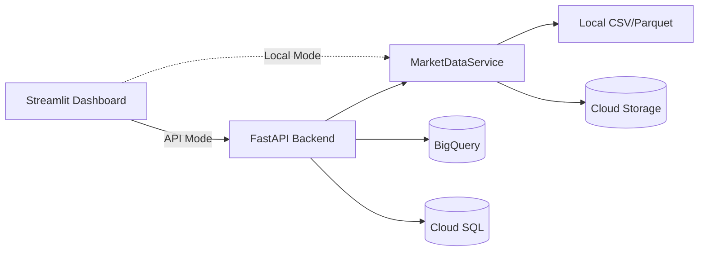
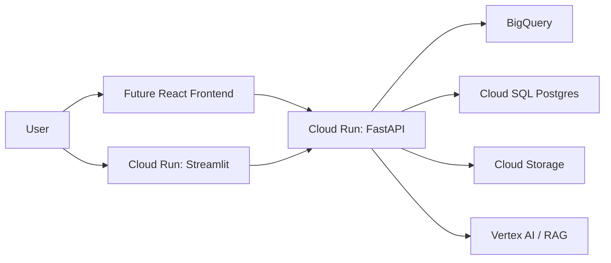

# FinSight Alpha

A professional financial engineering + AI project, built in phases. Each phase
adds a self-contained, portfolio-quality capability that later phases build on.

---

## Phases at a glance

- **Phase 1A - Notebook EDA**: a clean market-data engine plus an exploratory
  Jupyter notebook (`notebooks/01_market_data_eda.ipynb`). Exploration only.
- **Phase 1B - Dashboard + cloud-ready architecture**: a professional Streamlit
  dashboard, a pluggable data-provider architecture, and Docker/Cloud Run-ready
  infrastructure.
- **Phase 1C - Backend + database + cloud-ready storage (this phase)**: a full
  FastAPI backend, Cloud SQL/PostgreSQL metadata, BigQuery analytics storage,
  Cloud Storage for raw files, and a **dual-mode** dashboard (Local vs API).

---

## What Phase 1C delivers

1. **FastAPI backend** (`backend/`) with routers: `/health`, `/assets`,
   `/market-data/fetch`, `/market-data/{ticker}`, `/analytics/summary/{ticker}`,
   `/analytics/correlation`, `/analytics/sector-comparison`, plus CORS.
2. **Dual-mode dashboard** - a sidebar toggle switches between **Local Python
   Mode** (in-process functions) and **API Mode** (calls FastAPI via
   `API_BASE_URL`), with a live API health indicator.
3. **Cloud clients** (all optional, degrade gracefully):
   - `src/data/database.py` - SQLAlchemy engine for Cloud SQL / PostgreSQL.
   - `src/data/bigquery_client.py` - BigQuery dataset/table + DataFrame upload.
   - `src/data/cloud_storage_client.py` - GCS file / DataFrame upload.
4. **Storage helpers** - `save_dataframe_csv/parquet`, `load_processed_ticker_data`,
   `load_all_processed_data`, standardised `*_processed.csv` names.
5. **SQL** - `sql/001_create_tables.sql` (assets, jobs, watchlists) and
   `sql/bigquery_schema.md`.
6. **Infra** - `infra/Dockerfile.api`, `infra/Dockerfile.streamlit`,
   `infra/gcp_architecture.md`.

## Local Mode vs API Mode

- **Local Python Mode**: the dashboard imports and calls the Python functions
  directly. Simplest for development; no server needed.
- **API Mode**: the dashboard calls the FastAPI backend over HTTP. This mirrors
  the production topology (separate UI and API services on Cloud Run) and lets
  other clients (a future React app) reuse the same endpoints. Set the URL via
  `API_BASE_URL` in `.env` (default `http://127.0.0.1:8000`).



## How to run

```bash
# 1. FastAPI backend (terminal 1)
uvicorn backend.main:app --reload

# 2. Streamlit dashboard (terminal 2)
streamlit run app/streamlit_app.py

# 3. Tests
pytest
```

In the dashboard sidebar, pick **API Mode** to route through the backend (make
sure the API is running), or **Local Python Mode** to run everything in-process.

## Enabling the cloud (later)

Everything cloud-related is optional and controlled by environment variables in
`.env` (see `.env.example`):

- Set `DATABASE_URL` to enable Cloud SQL/PostgreSQL metadata (apply
  `sql/001_create_tables.sql`).
- Set `GCP_PROJECT_ID` + `BIGQUERY_DATASET` (and credentials) to enable BigQuery
  uploads; pass `upload_bigquery: true` to `/market-data/fetch`.
- Set `GCS_BUCKET_NAME` to enable Cloud Storage uploads.

Without these, the app runs fully on local files. See
[infra/gcp_architecture.md](infra/gcp_architecture.md) for the target design.

---

## Project structure

```
finsight-alpha/
  app/
    streamlit_app.py          # Multi-page dashboard (MAIN deliverable)
  backend/
    main.py                   # FastAPI skeleton (Phase 1C)
  data/
    raw/  processed/  exports/
  notebooks/
    01_market_data_eda.ipynb  # Phase 1A exploration only
  src/
    config.py                 # dates, tickers, sectors, paths, env
    data/
      market_data.py          # MarketDataService + download_stock_data
      storage.py              # CSV/Parquet + cloud placeholders
      providers/
        base.py               # MarketDataProvider (ABC)
        yfinance_provider.py   # default provider
        alpha_vantage_provider.py / polygon_provider.py  # placeholders
    analytics/
      metrics.py  correlation.py  sector_analysis.py
    visualization/
      plots.py
    utils/
      logging_utils.py
  tests/
    test_metrics.py  test_data_providers.py
  infra/
    Dockerfile.streamlit  Dockerfile.api  cloudrun_notes.md
  requirements.txt  .env.example  README.md  main.py
```

---

## Installation

> Requires Python 3.9+ (3.11 recommended).

```bash
python -m venv .venv
# Windows
.venv\Scripts\Activate.ps1
# macOS / Linux
source .venv/bin/activate

pip install -r requirements.txt

# Optional: copy the env template and add API keys later
cp .env.example .env        # macOS / Linux
copy .env.example .env      # Windows
```

---

## How to run

### Streamlit dashboard (main deliverable)

```bash
streamlit run app/streamlit_app.py
```

Then in the sidebar: pick tickers, a date range, and a provider (yfinance), and
click **Load data**.

### FastAPI backend

```bash
uvicorn backend.main:app --reload
```

Interactive docs at http://127.0.0.1:8000/docs.

### Batch pipeline (Phase 1A style)

```bash
python main.py
```

### Tests

```bash
pytest -q
```

### Notebook (exploration only)

```bash
jupyter notebook notebooks/01_market_data_eda.ipynb
```

---

## Dashboard pages

- **A. Market Overview** - KPI cards (latest close, total return, annualised
  volatility, max drawdown) and a summary table across the selection.
- **B. Single Asset Analysis** - price, cumulative returns, daily returns,
  rolling volatility, and drawdown for one ticker.
- **C. Multi-Asset Comparison** - normalised cumulative-return curves to compare
  growth of 1 unit invested.
- **D. Correlation Heatmap** - Pearson correlation of daily returns (low
  correlation indicates diversification benefit).
- **E. Sector Comparison** - sector-level average total return, annualised
  volatility, and max drawdown using the ticker-to-sector map.
- **F. Data Quality Report** - row counts, date coverage, and missing-value
  checks.

---

## Future cloud architecture



See [infra/cloudrun_notes.md](infra/cloudrun_notes.md) for deployment commands
and the BigQuery / Cloud Storage / Cloud SQL / Vertex AI roadmap.

---

## Financial metrics (recap)

- **Returns**: simple `P_t/P_{t-1} - 1` (aggregates across assets); log
  `ln(P_t/P_{t-1})` (aggregates across time, used for modelling).
- **Cumulative return**: compounded growth `prod(1+R) - 1`.
- **Volatility**: std of returns; annualised by `* sqrt(252)`.
- **Drawdown / max drawdown**: decline from the running peak; worst such decline.
- **Correlation**: co-movement of returns, the basis of diversification.
