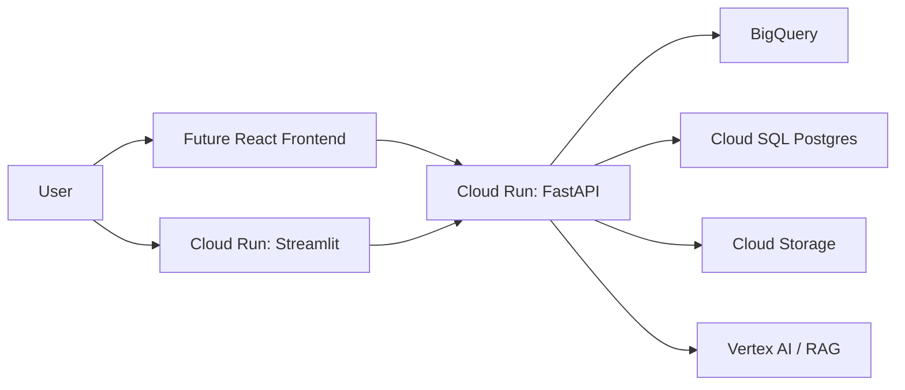

# FinSight Alpha

A professional financial engineering + AI project, built in phases. Each phase
adds a self-contained, portfolio-quality capability that later phases build on.

---

## Phases at a glance

- **Phase 1A - Notebook EDA**: a clean market-data engine plus an exploratory
  Jupyter notebook (`notebooks/01_market_data_eda.ipynb`). The notebook remains
  for exploration only.
- **Phase 1B - Dashboard + cloud-ready architecture (this phase)**: a
  professional Streamlit dashboard, a pluggable data-provider architecture, a
  FastAPI backend skeleton, and Docker/Cloud Run-ready infrastructure. **The
  dashboard is the main deliverable.**
- **Phase 1C/1D (future)**: live BigQuery / Cloud Storage / Cloud SQL
  integration, a richer (e.g. React) frontend, and Vertex AI + RAG.

---

## What Phase 1B delivers

1. **Provider architecture** - a `MarketDataProvider` interface with a working
   `YFinanceProvider` (default) plus `AlphaVantageProvider` and `PolygonProvider`
   placeholders. Swap or add sources (NSE/BSE later) without touching downstream
   code.
2. **`MarketDataService`** - one entry point to fetch a single ticker or many,
   returning a clean combined DataFrame.
3. **Storage** - local CSV + Parquet now; BigQuery / Cloud Storage placeholders
   ready for Phase 1C/1D.
4. **Analytics** - returns, volatility, drawdown, summary stats, correlation
   matrices, and sector-level aggregation.
5. **Visualization** - Plotly charts: price, daily/cumulative returns, rolling
   volatility, drawdown, correlation heatmap, sector comparison.
6. **Streamlit dashboard** - six pages with sidebar controls, KPI cards, and
   interactive charts.
7. **FastAPI backend** - `/health`, `/tickers`, `/market-data`, `/summary`.
8. **Infra** - Dockerfiles for both services and Cloud Run deployment notes.

---

## Project structure

```
finsight-alpha/
  app/
    streamlit_app.py          # Multi-page dashboard (MAIN deliverable)
  backend/
    main.py                   # FastAPI skeleton (Phase 1C)
  data/
    raw/  processed/  exports/
  notebooks/
    01_market_data_eda.ipynb  # Phase 1A exploration only
  src/
    config.py                 # dates, tickers, sectors, paths, env
    data/
      market_data.py          # MarketDataService + download_stock_data
      storage.py              # CSV/Parquet + cloud placeholders
      providers/
        base.py               # MarketDataProvider (ABC)
        yfinance_provider.py   # default provider
        alpha_vantage_provider.py / polygon_provider.py  # placeholders
    analytics/
      metrics.py  correlation.py  sector_analysis.py
    visualization/
      plots.py
    utils/
      logging_utils.py
  tests/
    test_metrics.py  test_data_providers.py
  infra/
    Dockerfile.streamlit  Dockerfile.api  cloudrun_notes.md
  requirements.txt  .env.example  README.md  main.py
```

---

## Installation

> Requires Python 3.9+ (3.11 recommended).

```bash
python -m venv .venv
# Windows
.venv\Scripts\Activate.ps1
# macOS / Linux
source .venv/bin/activate

pip install -r requirements.txt

# Optional: copy the env template and add API keys later
cp .env.example .env        # macOS / Linux
copy .env.example .env      # Windows
```

---

## How to run

### Streamlit dashboard (main deliverable)

```bash
streamlit run app/streamlit_app.py
```

Then in the sidebar: pick tickers, a date range, and a provider (yfinance), and
click **Load data**.

### FastAPI backend

```bash
uvicorn backend.main:app --reload
```

Interactive docs at http://127.0.0.1:8000/docs.

### Batch pipeline (Phase 1A style)

```bash
python main.py
```

### Tests

```bash
pytest -q
```

### Notebook (exploration only)

```bash
jupyter notebook notebooks/01_market_data_eda.ipynb
```

---

## Dashboard pages

- **A. Market Overview** - KPI cards (latest close, total return, annualised
  volatility, max drawdown) and a summary table across the selection.
- **B. Single Asset Analysis** - price, cumulative returns, daily returns,
  rolling volatility, and drawdown for one ticker.
- **C. Multi-Asset Comparison** - normalised cumulative-return curves to compare
  growth of 1 unit invested.
- **D. Correlation Heatmap** - Pearson correlation of daily returns (low
  correlation indicates diversification benefit).
- **E. Sector Comparison** - sector-level average total return, annualised
  volatility, and max drawdown using the ticker-to-sector map.
- **F. Data Quality Report** - row counts, date coverage, and missing-value
  checks.

---

## Future cloud architecture



See [infra/cloudrun_notes.md](infra/cloudrun_notes.md) for deployment commands
and the BigQuery / Cloud Storage / Cloud SQL / Vertex AI roadmap.

---

## Financial metrics (recap)

- **Returns**: simple `P_t/P_{t-1} - 1` (aggregates across assets); log
  `ln(P_t/P_{t-1})` (aggregates across time, used for modelling).
- **Cumulative return**: compounded growth `prod(1+R) - 1`.
- **Volatility**: std of returns; annualised by `* sqrt(252)`.
- **Drawdown / max drawdown**: decline from the running peak; worst such decline.
- **Correlation**: co-movement of returns, the basis of diversification.
