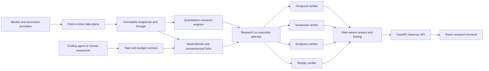

# FinSight Forge

> An evidence-first research environment where coding agents investigate financial systems and programmatic verifiers grade every claim.

[](https://www.python.org/)
[](https://fastapi.tiangolo.com/)
[](https://react.dev/)
[](docs/AGENT_EVALUATION_PROTOCOL.md)

FinSight Forge combines a point-in-time financial data plane, quantitative research engines, deterministic simulations, coding-agent evaluation, and a full-stack observer terminal. The central idea is strict: a plausible answer is not a result until independent code can reproduce its inputs, timing, calculations, and evidence.

The project serves two connected goals:

- **Agent systems research**: evaluate whether coding agents can produce trustworthy research under temporal, numerical, evidence, cost, and replay constraints
- **Financial engineering**: build auditable pricing, risk, machine learning, retrieval, market intelligence, and nonlinear dynamics workflows on the same truth foundation

## Why this project exists

Financial research exposes weak evaluation faster than a toy benchmark. A strategy can look profitable after seeing future data. A risk number can look precise while using the wrong distribution. A model can select the right label for the wrong structural reason. An agent can produce persuasive prose without producing a replayable finding.

FinSight Forge turns those failure modes into executable contracts:

```text
point-in-time snapshot + as_of + seed + task + budget + commit
                              |
                        coding attempt
                              |
       temporal + numerical + evidence + replay + cost gates
                              |
             verified finding + auditable research reward
```

The agent framework remains replaceable. The evidence contract, deterministic world, verifier, and frozen artifact define the research result.

## Project status

This table separates code on `main`, completed research on public branches, and planned work:

| Surface | Status | Evidence |
| --- | --- | --- |
| Point-in-time finance platform | Shipped on `main` | Data lineage, pricing, risk, portfolio, machine learning, retrieval-augmented generation, intelligence, API, and terminal modules |
| Agent evaluation core | Shipped on `main` | Versioned attempt schema, six deterministic metrics, completeness states, report generation, and sabotage tests |
| Forge benchmark and execution federation | Research-complete on [`finsight-forge`](https://github.com/RaghhavMalani/finsight-alpha/tree/finsight-forge) | Frozen tasks, counterfactual worlds, execution adapters, calibrated rewards, Reality Ladder evidence, and a provider-neutral single-agent harness |
| Nonlinear Dynamics Lab through D0.3.3.2 | Frozen on [`dynamics/d0.3.3.2-evidence-contract`](https://github.com/RaghhavMalani/finsight-alpha/tree/dynamics/d0.3.3.2-evidence-contract) | Estimator tournament, failure decomposition, targeted recovery, generalization autopsy, and a content-addressed evidence contract |
| D0.3.4 evidence-complete replication | Planned next milestone | Preregistered 400-world replication with no tuning and complete causal evidence per world |
| Reinforcement learning from verifiable rewards | Roadmap | Training starts only after live baselines, completeness gates, and contamination controls are frozen |

Branch-specific work is not presented as merged into `main`. Each research artifact records its own claim boundary.

## What makes FinSight different

FinSight treats reproducibility as part of the runtime rather than a note added after an experiment. The system records enough information to distinguish a failed model from a failed measurement process.

### Evidence before scores

Every evaluated attempt can retain its task identity, world identity, seed, source revision, data snapshot, cost, produced artifacts, verifier outcomes, and replay result. Missing evidence becomes `NOT_MEASURED`, `PARTIAL`, `UNDEFINED`, or an explicit instrumentation failure. It never becomes a convenient zero.

### Point-in-time truth

Data contracts carry observation time, availability time, source, revision, and `as_of` boundaries. This design blocks look-ahead leakage across filings, prices, macro data, features, labels, forecasts, and research retrieval.

### Counterfactual evaluation

The same research task can run against controlled world variants. Counterfactual pairs measure whether an agent found a durable mechanism or exploited an incidental path.

### Programmatic verification

Independent checks grade temporal validity, evidence completeness, numerical correctness, reproducibility, and domain-specific claims. The worker does not grade itself.

### Content-addressed research

Frozen JSON artifacts use canonical serialization and SHA-256 content addresses. Source seals, parent hashes, seed ledgers, and verifier scripts make research history inspectable.

### Negative controls

Sabotage tests mutate replay evidence, remove counterfactual pairs, stuff denominators, bypass hidden graders, falsify epistemic states, alter hashes, and create incomplete task grids. A verifier must reject these cases before its positive result carries weight.

## System architecture

The architecture keeps financial logic and verification independent from agent orchestration:


```mermaid
flowchart LR
    A[Market and document providers] --> B[Point-in-time data plane]
    B --> C[Immutable snapshots and lineage]
    C --> D[Quantitative research engines]
    C --> E[MarketWorld and counterfactual forks]
    F[Coding agent or human researcher] --> G[Task and budget contract]
    G --> E
    E --> H[Research or execution attempt]
    D --> H
    H --> I[Temporal verifier]
    H --> J[Numerical verifier]
    H --> K[Evidence verifier]
    H --> L[Replay verifier]
    I --> M[Gate-aware reward and finding]
    J --> M
    K --> M
    L --> M
    M --> N[FastAPI observer API]
    N --> O[React research terminal]
```

The dependency direction is deliberate. Pricing, risk, simulation, truth, and verifier code do not depend on a specific agent framework.

## Core research platform

The main branch contains the financial substrate and the first agent-evaluation layer.

### Truth and data lineage

The truth layer defines what was knowable at a requested time and records how every derived value was produced:

- Mandatory `as_of` boundaries for time-sensitive reads
- Observation, availability, source, and revision metadata
- Content-addressed computation contracts
- Epistemic states that separate known, unavailable, stale, partial, and undefined values
- Tenant-aware immutable snapshots and license policies
- Run and forecast ledgers backed by SQL migrations
- Cloud Storage, BigQuery, PostgreSQL, and local development adapters

### Quantitative analytics

The quantitative stack covers independent calculation and validation paths:

- Black-Scholes pricing, finite-difference Greeks, implied volatility, and volatility surfaces
- Monte Carlo simulation with convergence checkpoints and distribution diagnostics
- Value at Risk (VaR), Conditional Value at Risk (CVaR), and portfolio optimization
- Correlation, market structure, sector, liquidity, and risk-summary analytics
- Regime analysis with clustering and Hidden Markov Model (HMM) implementations
- Walk-forward signals, purged validation, horizon embargoes, and untouched outer holdouts
- Backtesting, paper execution, strategy construction, and dependency-graph analysis

### Grounded research

The retrieval-augmented generation (RAG) layer keeps research tied to source documents and tenant boundaries:

- Securities and Exchange Commission filing discovery and ingestion
- Investor-relations and exchange-document discovery
- Chunking, embeddings, lexical retrieval, reranking, and vector storage
- Ticker and tenant namespace isolation
- Factor extraction, segment intelligence, company snapshots, and research briefs
- Source-health, source-policy, and citation-aware answer contracts

### Market intelligence

The data and intelligence services combine multiple external feeds without erasing provenance:

- Market quotes, options, fundamentals, macro indicators, news, and sentiment
- Provider interfaces for Yahoo Finance, Alpha Vantage, Finnhub, and Polygon
- Company, country, agriculture, sector, and cross-asset context
- Pipeline-health checks, cache policy, and server-owned computation truth

### Full-stack observer

The product surface makes evidence inspectable without moving calculations into the browser:

- FastAPI routes for market data, pricing, risk, portfolio, research, factors, regimes, machine learning, strategies, paper execution, and agent context
- React 19 with TanStack Router and TanStack Query
- Tailwind CSS 4 and focused Three.js visualizations
- Live risk command center, terminal panels, correlation graph, options views, Monte Carlo surfaces, dependency analysis, replay controls, and command workflows
- Session authentication, organization resolution, role-aware access, and structured error correlation

## Agent evaluation contract

The evaluation layer converts research attempts into deterministic, auditable measurements. It publishes definitions rather than decorative scores.

| Metric | Definition | Default evidence gate |
| --- | --- | --- |
| Replay fidelity | Byte-identical replay comparisons divided by all replay comparisons | Exactly 100% across at least five runs per group |
| Contamination estimate | Mean real-world Sharpe minus counterfactual-world Sharpe | Every measured pair contains both worlds |
| Cost per verified finding | Total attempt cost divided by verifier-passing findings | Failed attempts remain in the numerator |
| Recovery rate | Recovered deterministic faults divided by injected deterministic faults | At least 90% |
| Judge-human agreement | Cohen’s kappa over paired categorical labels | At least 0.80; single-class samples remain undefined |
| Regression and seed variance | Pass rate and population variance of per-seed pass rates per commit | 100% pass, zero variance, and at least five complete seeds |

Build a scorecard from versioned JSON Lines evidence:

```bash
python scripts/build_agent_eval_report.py \
  --input path/to/attempts.jsonl \
  --output-dir data/exports/agent-eval \
  --require-complete \
  --require-gates
```

The schema lives in [`eval/schema/attempt-record.schema.json`](eval/schema/attempt-record.schema.json). The formulas, completeness rules, and anti-gaming controls live in [`docs/AGENT_EVALUATION_PROTOCOL.md`](docs/AGENT_EVALUATION_PROTOCOL.md).

## FinSight Forge research track

The Forge branch expands the main-branch evaluator into an executable coding-agent research environment. It preserves framework-independent task and finding contracts while adding deterministic worlds, execution engines, and sealed baselines.

### Frozen milestones

The completed Forge sequence includes:

1. **v0.1, benchmark kernel**: machine-actionable research tasks, finding schemas, deterministic temporal and numerical gates, replay checks, and shaped verified rewards
2. **v0.2.1, benchmark freeze**: an immutable 150-episode baseline with exact task and seed coverage
3. **v0.2.2, reward calibration**: calibrated gate-aware rewards and preserved warning semantics
4. **v0.2.3, execution federation**: 12 execution-conformance tasks, canonical execution contracts, prediction-market research cases, and independent negative controls
5. **v0.2.4, engine certification**: C4-certified VectorBT and Nautilus paths with source provenance and event-level execution evidence
6. **v0.2.4.1, Reality Ladder**: a 90-record measured ladder that preserves failed hftbacktest and legacy-HFT verdicts instead of deleting them
7. **v0.2.5, real single-agent harness**: provider-neutral agent loop, hard research budgets, durable paid-call checkpoints, hidden graders, six behavioral cases, three model conditions, three seeds, and independent false-alpha and routing metrics

Read the public branch documentation:

- [Forge contracts and implementation boundary](https://github.com/RaghhavMalani/finsight-alpha/blob/finsight-forge/docs/FINSIGHT_FORGE.md)
- [Execution federation and prediction-market pack](https://github.com/RaghhavMalani/finsight-alpha/blob/finsight-forge/docs/FINSIGHT_FORGE_V0_2_3.md)
- [Execution-engine certification](https://github.com/RaghhavMalani/finsight-alpha/blob/finsight-forge/docs/forge-v0.2.4-engine-certification.md)
- [Reality Ladder freeze](https://github.com/RaghhavMalani/finsight-alpha/blob/finsight-forge/docs/forge-v0.2.4.1-reality-ladder-freeze.md)
- [Real single-agent baseline contract](https://github.com/RaghhavMalani/finsight-alpha/blob/finsight-forge/docs/forge-v0.2.5-real-single-agent-baseline.md)

Live-model evidence remains pending. The repository does not convert a harness contract into a fabricated model result.

## Nonlinear Dynamics Lab

The Dynamics Lab asks whether nonlinear stochastic structure can be identified without collapsing model fit, topology, and evidence completeness into one score. The track uses deterministic synthetic worlds because ground truth must be known before any market claim is credible.

### Research sequence

The frozen sequence separates model selection, estimator power, causal failure analysis, targeted repair, and evidence instrumentation:

| Milestone | Question | Frozen conclusion |
| --- | --- | --- |
| D0.3 | Can the model hierarchy certify nonlinear structure? | Initial nonlinear certification under controlled worlds |
| D0.3.1 | Is the nonlinear structure identifiable across a preregistered world grid? | Power and topology limits measured |
| D0.3.2 | Which estimator recovers each structural family? | Estimator tournament frozen without hiding family-specific weaknesses |
| D0.3.2.1 | Why do confirmed failures occur? | Failure mechanisms decomposed into estimator, topology, support, and diffusion stages |
| D0.3.3 | Can targeted repairs recover the isolated failures? | `NO_GRADUATE`; several gates improved, but the complete capability vector did not pass |
| D0.3.3.1 | Does the confirmation evidence explain generalization? | `EVIDENCE_INSUFFICIENT`; aggregate outcomes lacked per-world causal traces |
| D0.3.3.2 | What evidence must the next replication retain? | Contract ready; zero scientific worlds executed and no outcome claimed |

### D0.3.3 result without score laundering

The targeted recovery artifact reports each confirmation gate independently:

| Confirmation capability | Observed | Frozen gate | Result |
| --- | ---: | ---: | --- |
| Linear specificity | 90% | At least 95% | Fail |
| False nonlinear discovery | 10% | At most 5% | Fail |
| False basin discovery | 0% | At most 5% | Pass |
| Double-well detection | 75% | At least 80% | Fail |
| Basin recall | 75% | At least 75% | Pass |
| Potential topology accuracy | 75% | At least 75% | Pass |
| State-diffusion detection | 65% | At least 80% | Fail |
| Numerical failure | 0% | At most 2% | Pass |

The result remains `NO_GRADUATE`. The real-market result remains `M1 / ABSTAIN`, and Hawkes-process work remains deferred.

### D0.3.4 preregistered direction

The next milestone will run a fixed 400-world replication with 100 linear controls, 100 no-basin controls, 100 double-well worlds, and 100 state-dependent diffusion worlds. Seeds will remain disjoint from every prior development and confirmation run.

The replication will preserve these traces for every admitted world:

- SINDy bootstrap coefficients, support identities, term inclusion frequencies, signs, and uncertainty
- Raw roots, clustered roots, derivatives, stability classes, persistence, basin assignments, and every topology gate
- Cross-fitted diffusion residuals, state-support bins, conditional variance, true and estimated diffusion, and each conjunctive gate
- Wilson 95% intervals, exact false-positive and false-negative decompositions, topology waterfalls, and diffusion gate patterns
- Capability-level classifications of `CAPABILITY_SUPPORTED`, `LIMITATION_REPLICATED`, or `UNRESOLVED`

An incomplete world will receive `INSTRUMENTATION_INVALID` and will not enter a scientific denominator. No tuning, early stopping, estimator replacement, market rerun, or Hawkes expansion is permitted inside this milestone.

Read the frozen [D0.3.3.2 evidence contract](https://github.com/RaghhavMalani/finsight-alpha/blob/dynamics/d0.3.3.2-evidence-contract/docs/dynamics-lab-d0-3-3-2.md).

## Verification strategy

Verification operates at multiple levels because one green test class cannot establish research validity.

### Unit and contract tests

Run the repository test suite:

```bash
python -m pytest -q
```

Focused suites cover numerical oracles, point-in-time modeling, data isolation, truth contracts, retrieval quality, source policy, API schemas, and sabotage controls.

### Cross-layer quantitative validation

Run the deterministic validation suite:

```bash
python scripts/run_validation_suite.py
```

The suite evaluates pricing, finite-difference Greeks, Monte Carlo convergence, VaR coverage, portfolio optimization, signal behavior, and RAG retrieval. It writes JSON and Markdown reports under `data/exports/validation/`.

### Negative controls

Run evaluator metrics and sabotage tests:

```bash
python -m pytest -q tests/test_agent_eval_metrics.py tests/sabotage
```

Negative controls are release evidence. They demonstrate that the evaluator rejects known corruptions rather than accepting only well-formed fixtures.

### Frontend verification

Validate the observer terminal:

```bash
cd frontend-v2
npm ci
npm run lint
npm run build
```

### Frozen research verifiers

Each research milestone includes a dedicated verifier on its branch. The verifier recomputes content addresses, parent seals, world identities, metrics, thresholds, and claim boundaries from the frozen artifact.

## Run locally

Local development requires Python 3.10 or newer and Node.js with npm.

### Start the API

Create an environment and install Python dependencies:

```bash
python -m venv .venv
```

Activate it on Windows:

```powershell
.venv\Scripts\Activate.ps1
```

Activate it on macOS or Linux:

```bash
source .venv/bin/activate
```

Install dependencies and start FastAPI:

```bash
pip install -r requirements.txt
uvicorn backend.main:app --reload
```

The OpenAPI interface is available at `http://127.0.0.1:8000/docs`.

### Start the terminal

Run the frontend in a second terminal:

```bash
cd frontend-v2
npm ci
npm run dev
```

Vite prints the local terminal URL after startup.

### Configure data providers

Copy the relevant environment template and provide only the services you intend to use:

- `.env.example` for local development
- `.env.cloud.example` for cloud-backed services

Provider credentials, database URLs, session secrets, storage configuration, and allowed origins stay outside source control. Runtime validation fails closed when production-required configuration is missing.

## API and product surfaces

FastAPI groups computation by domain so each surface can evolve without duplicating core logic:

| Domain | Representative capability |
| --- | --- |
| System | Health, readiness, authentication, and organization context |
| Market | Assets, quotes, market data, universe, macro, fundamentals, and news |
| Research | Retrieval, intelligence, factors, context, and research briefs |
| Quant | Pricing, analytics, portfolios, risk, regimes, and Monte Carlo studies |
| Strategy | Signals, backtests, strategy definitions, paper execution, and tapes |
| Agent | Research context and evaluator-facing workflows |

The browser renders server-owned results. Client components focus on navigation, interaction, state presentation, and visual analysis.

## Repository map

The main directories reflect the separation between truth, research, evaluation, and presentation:

```text
backend/                 FastAPI application and domain routes
frontend-v2/             React and TanStack observer terminal
src/truth/               epistemic states and computation contracts
src/data/                point-in-time access, providers, lineage, and licensing
src/analytics/           market, correlation, sector, and risk analytics
src/pricing/             options pricing, Greeks, and volatility surfaces
src/risk/                VaR, CVaR, and portfolio optimization
src/simulation/          Monte Carlo engines and distribution studies
src/ml/                  point-in-time features, models, signals, and stress tests
src/regime/              clustering, HMMs, labeling, and regime integration
src/rag/                 document discovery, retrieval, reranking, and grounded answers
src/intelligence/        profiles, snapshots, and intelligence services
src/eval/                deterministic metrics, schemas, and reports
eval/schema/             machine-readable evidence contracts
scripts/                 validation, benchmark, ingestion, and operations entry points
tests/sabotage/          adversarial controls for verifier behavior
sql/                     metadata, tenancy, lineage, and ledger migrations
infra/                   Cloud Run, container, and Google Cloud deployment material
```

Research branches add `src/world/`, `src/findings/`, `src/verifiers/`, `src/rewards/`, `src/benchmark/`, `src/execution/`, `src/prediction_markets/`, and `src/dynamics/` as their corresponding milestones advance.

## Technology stack

The stack favors inspectable components with mature numerical behavior:

| Layer | Technologies |
| --- | --- |
| Numerical research | Python, NumPy, SciPy, pandas, scikit-learn, hmmlearn |
| API and contracts | FastAPI, Pydantic, SQLAlchemy, OpenAPI |
| Data and storage | PostgreSQL, BigQuery, Google Cloud Storage, local snapshots |
| Research retrieval | pypdf, python-docx, BM25, embeddings, reranking, OpenAI-compatible clients |
| Frontend | React 19, TypeScript, TanStack Router, TanStack Query, Tailwind CSS 4 |
| Visualization | Three.js, React Three Fiber, D3 force layouts, custom terminal graphics |
| Delivery | Docker, Vercel, Google Cloud Run, GitHub Actions |
| Quality | Pytest, ESLint, Prettier, deterministic freeze and verification scripts |

## Engineering principles

The project follows a small set of non-negotiable rules:

1. **Time is part of every fact**: no historical answer may depend on information published later
2. **Missing is not zero**: incomplete evidence keeps an explicit epistemic state
3. **Workers do not grade themselves**: verification stays independent from task execution
4. **Seeds and artifacts are first-class inputs**: deterministic replay requires both
5. **Controls remain visible**: failed engines, failed gates, and null results stay in the record
6. **Aggregate scores cannot erase mechanisms**: capability vectors and failure decompositions remain available
7. **A market claim requires estimator power**: synthetic identifiability comes before production interpretation
8. **Branch status is explicit**: planned, active, frozen, and merged work use different labels

## Security and governance

The application includes session authentication, organization-scoped principals, role-aware access, tenant isolation, licensed snapshot controls, row-level security migrations, structured logging, and production configuration checks. These controls establish a serious foundation, but they do not constitute an external security audit or a production certification.

Use synthetic or licensed data in local and shared environments. Never commit provider keys, session secrets, private documents, paid model responses, or customer data.

## Roadmap

The roadmap advances evidence quality before model ambition.

### Phase 1: complete nonlinear replication

- Freeze D0.3.4’s 400-world seed ledger before execution
- Capture complete SINDy, topology, and diffusion evidence for every world
- Recompute capability intervals and exact failure decompositions independently
- Add the read-only replication API and milestone navigator
- Preserve `M1 / ABSTAIN` until a later protocol authorizes a market rerun

### Phase 2: freeze live agent baselines

- Execute the v0.2.5 provider-neutral harness under hard budgets
- Preserve paid-call checkpoints and incomplete runs
- Compare model, scaffold, and seed effects without denominator drift
- Publish cost, false-alpha, recovery, and experiment-routing measurements

### Phase 3: expand the tool and sandbox plane

- Complete the Model Context Protocol (MCP) surface for data, experiments, evidence, and replay
- Isolate coding execution from evaluator state
- Add least-privilege credentials, durable run manifests, and policy-aware artifact access
- Extend fault injection across data, code, execution, and communication boundaries

### Phase 4: study orchestration

- Compare single-agent and multi-agent workflows under matched budgets
- Measure coordination cost, duplicated work, evidence loss, and recovery behavior
- Train an experiment router only after deterministic routing labels exist
- Keep orchestration conclusions separate from financial-model conclusions

### Phase 5: train with verifiable rewards

- Convert frozen verifier outcomes into reinforcement learning from verifiable rewards (RLVR) data
- Audit reward hacking with counterfactual and sabotage suites
- Track generalization across commits, tasks, seeds, market regimes, and tool configurations
- Publish trained-policy claims only when replay, contamination, and cost gates pass

No roadmap item is presented as shipped evidence.

## Current limitations

The repository has deliberate boundaries:

- Live single-agent benchmark evidence is not yet frozen on `main`
- The complete MCP tool plane and isolated coding sandbox remain roadmap work
- D0.3.3 did not graduate nonlinear capability
- D0.3.3.2 defines evidence requirements but contains zero scientific worlds
- D0.3.4 is preregistered direction, not a completed replication
- Hawkes dynamics remain deferred
- The platform is not investment advice, a broker, or an execution venue
- Authentication and tenancy controls have not received an external security audit
- Billing, subscriptions, growth analytics, and organization-administration polish are outside the current research scope

## Career-relevant engineering scope

FinSight demonstrates end-to-end ownership across research engineering, applied machine learning, quantitative systems, agent evaluation, backend APIs, frontend visualization, cloud infrastructure, testing, and technical documentation. The strongest project signal is not feature count. It is the discipline to preserve null results, freeze evidence, test the verifier adversarially, and state exactly what the system has not proved.

## Documentation index

Start with these documents on `main`:

- [Agent evaluation protocol](docs/AGENT_EVALUATION_PROTOCOL.md)
- [V2 truth foundation](docs/V2_TRUTH_FOUNDATION.md)
- [Production runbook](docs/PROD_RUNBOOK.md)
- [Gap review](docs/GAP_REVIEW.md)
- [Evaluation schema guide](eval/README.md)
- [Frontend guide](frontend-v2/README.md)

For branch-specific research, use the Forge and Dynamics links in their sections above. Those links point to the exact public branch that contains each artifact.

## Responsible use

FinSight is a research and engineering project. Its outputs can be incomplete, wrong, delayed, or based on synthetic data. Do not use repository output as individualized investment advice or as the sole basis for a trading, lending, compliance, or risk decision.
