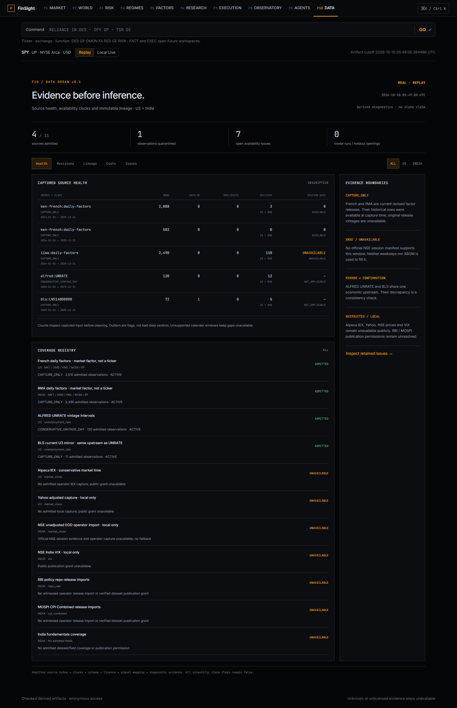
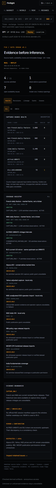

# Data Organ v0.1

F10 `/data` presents captured source health, coverage, annual macro revisions,
mirror consistency, signal lineage, retained issues and India cost evidence.
Replay contains real, attributed derived diagnostics. All four scientific claim
flags remain false. It does not run a model or open a holdout.

## Evidence and source boundaries

The public registry has eleven bounded profiles. French and IIMA daily research
factors, ALFRED UNRATE and the BLS LNS14000000 current mirror have numerical
publication grants. French/IIMA historical rows remain `CAPTURE_ONLY`; MKT is a
market factor, not a ticker. Their SDK field names are lowercase `mkt`, `smb`,
`hml`, `mom`, `rf`; the library labels and source definitions are retained.

The comparative factor window is 2024–2025. French FF3 and momentum are separate
source files: 2,008 and 502 field observations, respectively. IIMA supplies 2,490
field observations. Current coverage selects one admitted version per source
file; prior captures and attempts remain in the append-only journal.

ALFRED supplies actual captured real-time intervals for UNRATE periods 2020–2025.
The existing provider admits a vintage conservatively at the next New York
midnight after its date. BLS current observations are available at their capture
clock. Their same-day snapshot comparison is a **mirror consistency check** of
one BLS economic upstream. It is not independent confirmation or reconstructed
BLS vintage history. Different capture days or incompatible definitions, feeds,
units, adjustments or information vintages remain incompatible.

Public revision evidence is annual counts and absolute revision sums across at
least six observation periods. The annual observation-window control keeps the
capture vintage fixed; it does not claim a historical publication-time replay.
Raw vintage matrices, observation values, OHLCV and individual price discrepancies
stay local. Public projection uses nested positive whitelists as well as the
shared raw-field rejection and SHA/byte checks.

XNYS diagnostics use the evidenced exchange-calendar package version. XNSE
requires an operator-supplied, sealed official session manifest with a supported
window. No NSE calendar is fabricated from weekdays or XBOM. IIMA gap counts
therefore remain unavailable. Calendar version, session seal, threshold profile,
source/input/quarantine hashes and diagnostic implementation enter diagnostic
identity.

Alpaca remains IEX-only with conservative reconstructed market-time availability.
Yahoo, NSE prices and India VIX remain publicly unavailable. Local Yahoo health
discloses whether its input is captured or already cleaned by a provider. RBI
repo and MOSPI CPI imports require release citations, clocks and revision
identities; their dataset-specific publication permissions remain unresolved.
India fundamentals have no fabricated PIT coverage.

## Observed findings

The actual BLS response includes one nonnumeric observation token, retained in
quarantine rather than changed to zero. It is delivered in reverse period order;
that ordering finding remains visible. The captured ALFRED history contains 120
vintage rows across 71 observation periods, 32 revised periods and 49 value
transitions. The initial compatible mirror has 71 pairs and no value differences.
These are descriptive findings on the bounded captured window.

Factor diagnostics preserve zeros and flag outliers using a per-asset/field
10-MAD profile. Flags are not corrections or economic verdicts. Capture age and
observation age are separate; an intentionally historical window is labelled as
such. Capture-only releases have no fabricated historical publication-lag
distribution. Unsupported OHLCV and adjustment diagnostics stay unavailable.

The issue log retains provider/credential/calendar/permission unavailability,
quarantines and earlier ingestion failures, including adapter implementation
failures encountered during this implementation. Later successful admissions do
not erase those attempts or automatically resolve issues. Local seals detect
substitution against retained evidence; they are not third-party signatures.

## India cost evidence

The calculator supports NSE cash equity BUY/SELL and delivery/non-delivery using
exact Decimal inputs and effective-dated components. It separates STT, stamp,
SEBI turnover, exchange, IPFT and GST. Each supported component includes a
primary-source URL, exact response SHA, publication/capture metadata and an
explicit supported interval. Current rates are not extrapolated backward.

The fixed public example is an INR 100,000 delivery buy on the evidenced date
2026-10-09. Its known **statutory subtotal is INR 118.17**, explicitly partial.
GST's invoice base, brokerage, spread, slippage and DP inputs are missing, so
**all-in estimated trading cost is unavailable**. Missing components are never
zero assumptions. Decimal components are summed before HALF_UP to INR 0.01;
this does not claim broker contract-note equivalence. Unsupported dates and
derivatives stay unavailable.

Primary fee evidence: [NSE statutory levies](https://www.nseindia.com/static/invest/first-time-investor-sebi-turnover-fees-stt-other-levies),
[FA64232](https://nsearchives.nseindia.com/content/circulars/FA64232.pdf) and
[FA73061](https://nsearchives.nseindia.com/content/circulars/FA73061.pdf).
The evidence-supported intervals are sealed in
`eval/data-organ/v0.1/india-cost-schedules.json`.

## Local operation and scheduled refresh

```sh
python scripts/collect_data_organ.py
python scripts/collect_data_organ.py --network
python scripts/export_data_organ_replay.py
python scripts/verify_data_organ.py --runtime data/exports/replay-source/data-organ-runtime
```

The first command admits the existing checked French/IIMA captures. The network
option captures those exact official sources anew plus bounded ALFRED/BLS data.
ALFRED needs `FRED_API_KEY`; BLS uses its bounded key-free API. Credentials never
enter receipt/journal metadata or error URLs. Missing credentials, transport,
calendar evidence or a publication grant record failed/`UNAVAILABLE` attempts.
Existing evidence remains addressable; the coverage view marks retained captures
explicitly. A cold scheduled runner validates and retains prior derived evidence
without inventing raw files or silently fetching a weaker source.

The scheduled workflow verifies the archived Phase 2 reference, refreshes only
bounded Data Organ sources, and commits only derived Data Organ summaries and
their Replay pointers. It never recomputes the checked plugin, changes the three
v1 run IDs or opens its holdout. Repeating an export with the same journal,
declared computation files and evidence is idempotent. Git HEAD records execution
provenance separately from deterministic diagnostic identity.

Operator imports are explicit and restricted to a local organization:

```sh
python scripts/collect_data_organ.py --import-file capture.csv --metadata-file capture.meta.json --organization 1 --runtime data/exports/replay-source/data-organ/1
```

The metadata uses `data-organ-operator-capture/1` with `source`, `source_url`,
`sha256`, `captured_at` and a two-date `window` of at most two years. Market
imports also require `asset`, `calendar`, `price_basis` and `cleaning_stage`.
Naive date-only observations need the explicit `date_only_utc_period` convention;
other naive timestamps fail. NSE imports require the complete official XNSE
session manifest. Alpaca imports require a complete single daily page, evidenced
`feed=iex`, `adjustment=raw`, `stream=daily`, a supported asset and the exact
official endpoint. RBI/MOSPI use `india-macro-release/1` observations with
`observed_at`, `available_at`, `value`, `revision` and `publication_evidence`.
No operator import grants anonymous publication permission.

Admissions seal source bytes, clocks, schema, licence and signal mappings before
the Parquet append. Interrupted appends retain failures and can recover
idempotently. Authenticated `/data/*` GETs inspect only the organization's local
registry and never fetch upstream. Production runtime access is unavailable;
anonymous visitors use checked Replay. Runtime DuckDB/Parquet, raw captures and
vintage matrices remain ignored.

## Recording and verification

Open F10 in Replay at 1440px and 390px. Record health/coverage, India’s unavailable
calendar, annual US revisions and mirror, source/admission lineage, the partial
India cost example and retained issue evidence. `/data?section=revisions` and
`country`, `source`, `cutoff` URL state make the view reproducible. `cutoff` is an
annual **observation-window** end (2020–2025), not a publication cutoff.

The Python gates cover source substitution, clocks, tenant boundaries, recovery,
calendar sabotage, incompatible providers, genuine predecessors, costs,
lineage, publication grants, cold-refresh retention and archive preservation.
The browser verifier checks real Replay, changed-byte failures, command/F10
navigation, desktop/mobile overflow and Chrome/Edge/Firefox. Existing shell QA
continues to preserve F5 refresh and F7 caret browsing.




