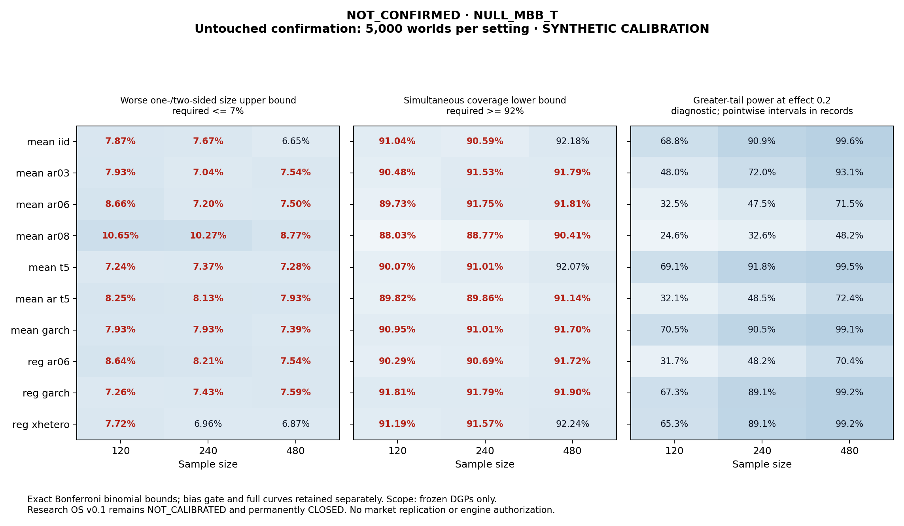

# The separate inference calibration study: NOT_CONFIRMED

The predeclared discovery rule selected **NULL_MBB_T**. Untouched confirmation passed **2/30 settings** under the simultaneous practical gate. The selected replacement is not certified; no fallback candidate was tested on confirmation.

Research OS v0.1 remains permanently **NOT_CALIBRATED / CLOSED**. No original outcome, momentum study or gate was replaced. VectorBT and a market replication remain unauthorized.

## Discovery is selection, not certification

Four methods were predeclared before outcomes; 1,000 worlds per setting cover 30 settings. The fixed rule ranks point-size/coverage/bias violations, then power, worst null size and declared order. All four had discovery violations. No candidates, bandwidths or seeds were added after seeing results.

| Candidate | Point violations | Worst null size | Average greater-tail power over .1/.2/.4 |
|---|---:|---:|---:|
| NULL_MBB_T | 20 | 9.5% | 66.3% |
| HAC_T | 40 | 19.6% | 69.6% |
| HAC_NORMAL | 42 | 20.8% | 69.8% |
| STATIONARY_PAIRS_T | 51 | 11.1% | 67.4% |

The power average above is solely the frozen selection statistic across these settings/effects, not an applicable market probability. The selection receipt was committed before any confirmation world; it was not replaced after confirmation.

## Untouched confirmation

The selected method alone was evaluated on 5,000 seed-disjoint worlds per setting: 150,000 null worlds and 450,000 planted-effect evaluations. The effect grid shares each world's errors/controls through declared location equivariance; those three planted shifts are not three independent input corpora.

Greater and two-sided Type-I error upper bounds must each be <=7%; nominal 95% interval coverage lower bounds must be >=92%. Ninety one-sided exact Clopper-Pearson bounds use Bonferroni family alpha .04. Standardized absolute coefficient bias plus the separately allocated Monte Carlo t margin must be <=.10 in every setting. That bias margin is approximate under non-Gaussian worlds. All worlds, including failures, remain recorded.

| Setting | Greater size | Two-sided size | Worse size UCB | CI coverage | Coverage LCB | Bias upper / SD | Reported SE / empirical SD | Power .1 / .2 / .4 | Gate |
|---|---:|---:|---:|---:|---:|---:|---:|---|---|
| mean_iid_n120 | 6.62% | 5.66% | 7.87% | 92.36% | 91.04% | 0.060 | 0.943 | 30.8% / 68.8% / 99.4% | FAIL |
| mean_iid_n240 | 6.44% | 6.30% | 7.67% | 91.94% | 90.59% | 0.055 | 0.935 | 47.2% / 90.9% / 100.0% | FAIL |
| mean_iid_n480 | 5.50% | 5.44% | 6.65% | 93.42% | 92.18% | 0.052 | 0.979 | 71.0% / 99.6% / 100.0% | PASS |
| mean_ar03_n120 | 6.68% | 6.34% | 7.93% | 91.84% | 90.48% | 0.055 | 0.902 | 21.7% / 48.0% / 92.0% | FAIL |
| mean_ar03_n240 | 5.86% | 5.86% | 7.04% | 92.82% | 91.53% | 0.067 | 0.928 | 32.3% / 72.0% / 99.7% | FAIL |
| mean_ar03_n480 | 6.32% | 6.22% | 7.54% | 93.06% | 91.79% | 0.057 | 0.936 | 50.4% / 93.1% / 100.0% | FAIL |
| mean_ar06_n120 | 6.72% | 7.36% | 8.66% | 91.14% | 89.73% | 0.062 | 0.830 | 17.0% / 32.5% / 69.8% | FAIL |
| mean_ar06_n240 | 5.98% | 6.00% | 7.20% | 93.02% | 91.75% | 0.087 | 0.905 | 20.5% / 47.5% / 91.8% | FAIL |
| mean_ar06_n480 | 6.08% | 6.28% | 7.50% | 93.08% | 91.81% | 0.063 | 0.927 | 32.0% / 71.5% / 99.7% | FAIL |
| mean_ar08_n120 | 8.04% | 9.22% | 10.65% | 89.54% | 88.03% | 0.060 | 0.728 | 14.8% / 24.6% / 51.1% | FAIL |
| mean_ar08_n240 | 7.70% | 8.86% | 10.27% | 90.24% | 88.77% | 0.073 | 0.798 | 17.4% / 32.6% / 70.6% | FAIL |
| mean_ar08_n480 | 6.88% | 7.46% | 8.77% | 91.78% | 90.41% | 0.059 | 0.864 | 22.5% / 48.2% / 91.6% | FAIL |
| mean_t5_n120 | 5.90% | 6.04% | 7.24% | 91.46% | 90.07% | 0.061 | 0.930 | 31.6% / 69.1% / 98.7% | FAIL |
| mean_t5_n240 | 6.12% | 6.16% | 7.37% | 92.34% | 91.01% | 0.056 | 0.950 | 48.1% / 91.8% / 100.0% | FAIL |
| mean_t5_n480 | 6.08% | 5.72% | 7.28% | 93.32% | 92.07% | 0.054 | 0.976 | 70.8% / 99.5% / 100.0% | FAIL |
| mean_ar_t5_n120 | 6.98% | 6.38% | 8.25% | 91.22% | 89.82% | 0.061 | 0.846 | 16.8% / 32.1% / 70.2% | FAIL |
| mean_ar_t5_n240 | 6.76% | 6.86% | 8.13% | 91.26% | 89.86% | 0.059 | 0.869 | 22.3% / 48.5% / 91.0% | FAIL |
| mean_ar_t5_n480 | 6.50% | 6.68% | 7.93% | 92.46% | 91.14% | 0.064 | 0.916 | 31.9% / 72.4% / 99.4% | FAIL |
| mean_garch_n120 | 6.68% | 5.50% | 7.93% | 92.28% | 90.95% | 0.054 | 0.924 | 33.5% / 70.5% / 98.0% | FAIL |
| mean_garch_n240 | 6.68% | 5.60% | 7.93% | 92.34% | 91.01% | 0.058 | 0.941 | 49.0% / 90.5% / 100.0% | FAIL |
| mean_garch_n480 | 6.18% | 5.56% | 7.39% | 92.98% | 91.70% | 0.062 | 0.955 | 70.0% / 99.1% / 100.0% | FAIL |
| reg_ar06_n120 | 7.34% | 6.90% | 8.64% | 91.66% | 90.29% | 0.062 | 0.817 | 17.2% / 31.7% / 70.2% | FAIL |
| reg_ar06_n240 | 6.34% | 6.94% | 8.21% | 92.04% | 90.69% | 0.053 | 0.868 | 21.9% / 48.2% / 91.2% | FAIL |
| reg_ar06_n480 | 6.30% | 6.32% | 7.54% | 93.00% | 91.72% | 0.064 | 0.916 | 31.6% / 70.4% / 99.6% | FAIL |
| reg_garch_n120 | 6.06% | 5.40% | 7.26% | 93.08% | 91.81% | 0.067 | 0.901 | 30.8% / 67.3% / 97.6% | FAIL |
| reg_garch_n240 | 6.22% | 5.12% | 7.43% | 93.06% | 91.79% | 0.056 | 0.941 | 46.8% / 89.1% / 99.9% | FAIL |
| reg_garch_n480 | 6.36% | 5.48% | 7.59% | 93.16% | 91.90% | 0.067 | 0.959 | 68.5% / 99.2% / 100.0% | FAIL |
| reg_xhetero_n120 | 6.48% | 5.76% | 7.72% | 92.50% | 91.19% | 0.059 | 0.927 | 29.0% / 65.3% / 98.6% | FAIL |
| reg_xhetero_n240 | 5.78% | 5.72% | 6.96% | 92.86% | 91.57% | 0.070 | 0.936 | 44.5% / 89.1% / 100.0% | FAIL |
| reg_xhetero_n480 | 5.64% | 5.70% | 6.87% | 93.48% | 92.24% | 0.067 | 0.958 | 67.5% / 99.2% / 100.0% | PASS |

Both full power curves, pointwise exact intervals, raw coefficient bias/MCSE, both SE/SD ratios, every per-world result and all individual gates are retained in the frozen exports. Pointwise power intervals are descriptive and are not simultaneous certification. Bootstrap null-restricted p-values and unrestricted bootstrap-t intervals were independently assessed, without claiming exact inversion.

## Provenance and limits

Preregistration commit `3c16fe0` and its receipt precede outcomes. Discovery calculation commit `bc12939`; selection commit `9af78e6`; confirmation execution commit `39a30ac`. Each outcome carries its actual code/environment identity, input-data hashes and declared seed domains. Integer seeds exceed 2^256 and are disjoint from v0.1 and from the other phase. Method/DGP/metric/selector/seed and world-computation code remains unchanged between phases.

A pre-confirmation command was rejected before opening worlds because sorted JSON row ordering changed a discovery audit average by one floating-point bit. A sealed guard-only correction restores the declared setting order and reproduces the original selection receipt exactly; all original evidence and the rejected command remain. A separate cross-library read-only check measured at most 6.4116e-15 arithmetic differences, with zero count/decision changes. Its 1e-12 comparison cap never relaxes artifact hashes, counts, selections, acceptance thresholds or gate decisions.

These are **SYNTHETIC_CALIBRATION** worlds, not market returns, historical-vintage evidence or alpha. Error processes are stationary Gaussian/t5 AR and declared GARCH/control-dependent heteroskedastic cases at n=120/240/480, targeting an intercept with zero or two controls. Calibration outside those definitions is unestablished. No post-confirmation fallback, method repair, new source or market experiment was run.

See [the full frozen design](../research-os-v0.1.1-inference-calibration.md) and `data/exports/research_os_v0_1_1/manifest.json` for identities and byte seals. The next action is review of this separate inference gate; the old closed gate is never reopened.
