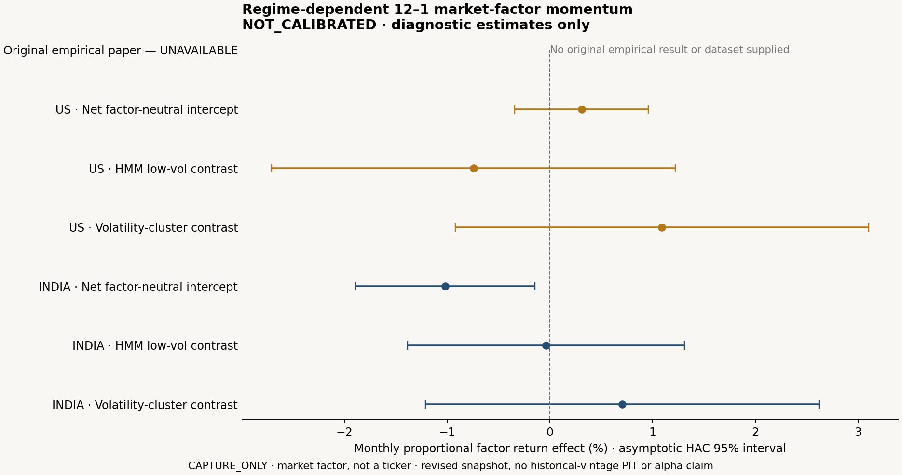

# The frozen momentum study does not support a positive US–India result

The US estimate is uncertain and the Indian estimate is negative. Neither primary result supports the frozen positive hypothesis after the 46-trial Holm correction. More fundamentally, two statistical calibration cases failed their preregistered acceptance criterion, so these estimates remain diagnostic and the trading-engine gate is **closed**.

This is **CAPTURE_ONLY — market factor, not a ticker**: time-series 12–1 momentum on the existing French and IIMA market-factor captures, with monthly rebalance. It is a researcher-defined extension, not cross-sectional stock momentum or an exact replication of an empirical paper. The fixed revised snapshots cannot reconstruct historical-vintage point-in-time information. Phase 2's plugin SDK and Phase 3's data organ are not claimed complete.

## First frozen findings

The primary endpoint is the net monthly regression intercept, controlling contemporaneous market, size, value and momentum factors, with Newey–West HAC errors (six monthly lags). Its interpretation is a descriptive factor-neutral intercept, not validated investment alpha.

| Country | Holdout | Months | Intercept, %/month | HAC 95% CI | Raw one-sided p | Holm p | Prospective power |
|---|---|---:|---:|---|---:|---:|---:|
| US | 2001-01–2026-08 | 308 | +0.309 | [−0.341, +0.960] | 0.1756 | 1.0000 | 12.9% |
| India | 2008-01–2025-12 | 216 | −1.018 | [−1.892, −0.145] | 0.9888 | 1.0000 | 11.2% |

The Indian wrong-direction control has a positive diagnostic intercept (+0.891%/month) and raw p=0.02095; its Holm p=0.94271. That failure of an apparent uncorrected finding to survive the frozen family is retained. It is not selected as a replacement strategy.

Neither the HMM contrast nor the volatility-clustering contrast survives Holm in either country. Both **new train-only two-state HMM fits** converge under the frozen absolute likelihood-increment criterion. These are different fits from the existing full-history, four-state Observatory Replay; that older evidence is unchanged. The first and second halves, leave-2008/2020-out, wrong direction, random signal, circular-shift controls, shuffled regimes, 6–1/9–1 windows, no-controls and all five cost levels are retained, including the two unavailable sector-panel trials.

## Four-way scorecard

| Dimension | Verdict | Reason |
|---|---|---|
| STATISTICAL | INCONCLUSIVE | Failed calibration and low prospective power; neither primary passes Holm. |
| ECONOMIC | UNAVAILABLE | Factor captures are not traded instruments. Instrument spreads, borrow, execution and Indian statutory fee evidence are absent. |
| REGIME_DEPENDENCE | INCONCLUSIVE | Four corrected contrasts do not establish dependence; calibration and power prevent stronger inference. |
| CROSS_MARKET | INCONCLUSIVE | The frozen positive result is not supported in both countries. Sources, periods and hypothetical costs differ. |

Prospective power assumes a 0.2% monthly effect, 5% monthly standard deviation and AR(1)=0.3. These assumptions were frozen before outcomes. Low power is not evidence that the true effect is zero. The power calculation is an approximate planning model, especially for factor-controlled regime contrasts, not a calibrated retrospective assessment of absence.

## Test the tester

Each of eight settings has 1,000 deterministic null and 1,000 planted-effect worlds. The frozen rule requires nominal 5% to lie inside each null setting's 95% Wilson interval; planted-power lower bounds must exceed 80%. Acceptance was not widened after observing these results.

| Setting | Null rejection rate | 95% Wilson CI | Planted power |
|---|---:|---|---:|
| Welch, IID | 5.3% | [4.07%, 6.87%] | 98.1% |
| Paired, IID | 5.8% | [4.51%, 7.42%] | 98.7% |
| Bootstrap, IID | 4.5% | [3.38%, 5.97%] | 100% |
| Sign permutation, IID | 4.0% | [2.95%, 5.40%] | 100% |
| **HAC, IID** | **6.5%** | **[5.13%, 8.20%]** | 100% |
| HAC, AR(1) | 5.5% | [4.25%, 7.09%] | 99.5% |
| Block bootstrap, AR(1) | 5.2% | [3.99%, 6.76%] | 99.1% |
| **HAC regression, AR(1)** | **7.1%** | **[5.67%, 8.86%]** | 99.5% |

All planted-power lower bounds exceed 97%, but power success does not cure inflated null rejection. Separate 46-member global-null families pass the frozen family criterion: Holm FWER 4.0% [2.95%, 5.40%], BH global-null FDR 4.3% [3.21%, 5.74%]. This calibration is limited to its Gaussian IID/AR(1) protocol; it does not calibrate all market errors or the circular-shift regression diagnostic.

## Provenance and boundaries

Preregistration `e8b48dd1a00aa7e6d0d2cb3bd2c82840afc4b557ec17d38da4f9253b48370a84` was frozen at `2026-10-08T10:56:04.242368Z` and committed at `4301093` before outcomes. Calibration and the first study executed code commit `2e72e56`. Each record includes complete code, data, split, seed, environment, parameters, test and artifact identities. The initial study records 46 holdout openings; two explicit computational reruns bring the retained total to 48. Both reruns reproduce identical run and artifact identities; they are not exact paper replications.

The source-availability cutoff is `2026-10-08T04:10:00Z`; actual source capture times remain October 7, 2026. Historical observation dates are never substituted for those availability receipts. Daily factor returns are compounded into a monthly research aggregate; compounding daily excess returns is not an investable monthly total-return portfolio. The cost frontier is explicitly hypothetical: US 10 bps and India 25 bps per exposure change, initial entry and final liquidation included; 0/10/25/50/100 bps all retained. A statutory Indian cost model remains unavailable.

Sources: [Ken French daily factors](https://mba.tuck.dartmouth.edu/pages/faculty/ken.french/ftp/F-F_Research_Data_Factors_daily_CSV.zip), [French momentum](https://mba.tuck.dartmouth.edu/pages/faculty/ken.french/ftp/F-F_Momentum_Factor_daily_CSV.zip), [IIMA four factors and market returns](https://faculty.iima.ac.in/iffm/Indian-Fama-French-Momentum/DATA/2025-12_FourFactors_and_Market_Returns_Daily_SurvivorshipBiasAdjusted.csv). The [Bailey/López de Prado DSR paper](https://www.davidhbailey.com/dhbpapers/deflated-sharpe.pdf) is used only to validate statistics and anchored paper evidence. Original empirical data, seeds and CIs remain missing. Real-study DSR remains unavailable because independent search count and IID assumptions are not established; the formulas and diagnostic PSR are still exercised.

The next decision is a review of this failed gate. No engine integration, new sources, changed preregistration or repaired outcome was used to make it pass.
