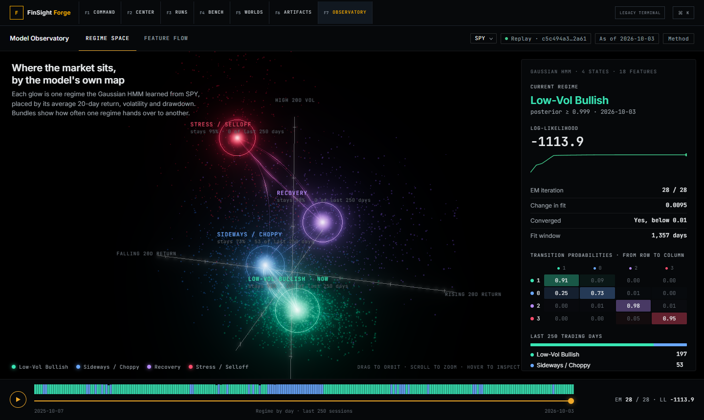
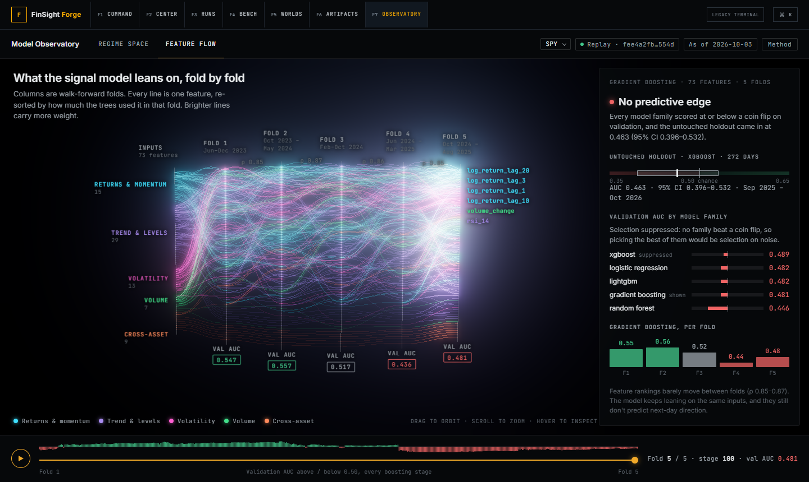

# Model Observatory

`/observatory` exposes two read-only research scenes: **Regime space** (HMM optimization) and **Feature flow** (the signal model's walk-forward folds). Forge F7, the command palette, and the SPY/QQQ/IWM legacy regime panel link to it. Scene/ticker choices are bookmarkable; the ticker list is whatever `manifest.json` declares, each ticker with both a checked HMM and a checked signal replay. The default is a checked replay of actual installed evidence, bounded at **2026-10-03T04:15:00Z**.

The visual spec is [`observatory-reference.html`](observatory-reference.html), a single-file three.js page built from `spy-*.json`; [`observatory-redesign.md`](observatory-redesign.md) is the change list that came with it.

## Evidence and model semantics

Both endpoints require `ticker`, `as_of` and `source=real`. The HMM additionally requires `n_states` (2–6). They consume the activated publication-evidenced dataset, admitting only daily rows with `observed_at <= available_at <= as_of`. The Observatory price source is `ALPACA_IEX`. Date labels use the source's completed daily interval end in UTC; the latest interval represents the October 2 trading session and ends October 3 at 04:00Z.

Each trace returns admitted-input SHA-256, cutoff, latest observation/availability, source, quality, coverage, count, price basis and snapshot identities. `CONSERVATIVE_MARKET_TIME` and `RECEIVE_TIMESTAMP_CAPTURED` remain distinct. Combined qualities are explicitly `MIXED`, with the full quality list in the provenance drawer. The current checked replays use conservative historical timing and unadjusted IEX prices. Market, causal and validated-alpha claim flags remain false.

`LIVE MODEL RUN` means computation by the authenticated backend on locally installed evidence. The collector remains stopped. `REPLAY` identifies a checked artifact by its exact byte SHA-256, verified before geometry is rendered. Invalid SHA, schema, cutoff, probability vectors, quality disclosure or split evidence hides the scene. A changed request synchronously hides the previous trace and cancels its fetch.

### HMM

```text
GET /regime/hmm/trace?ticker=SPY&as_of=2026-10-03T04:15:00Z&n_states=4&source=real
```

The existing regime feature construction and StandardScaler feed a full-covariance GaussianHMM with seed 42. Each subsequent one-iteration `fit` retains its parameters (`init_params=""`). The trace records likelihood, means, covariance diagonals, transition matrix, full-fit posterior tail, convergence delta/flag and scaler parameters/hash. It stops at absolute likelihood delta < 0.01 or 100 iterations. Cache entries are bounded, single-flight, tenant-scoped and expire after 30 minutes; their keys include admitted input content and evaluated cutoff.

The last 250 particles are retrospective posteriors under the selected bounded fit. State names describe the final fit's components; the scrubber exposes the actual EM parameter history. They do not assert contemporaneously known historical regimes.

Position means something. Each state sits at its own mean on `rolling_return_20` (x), `realized_vol_20` (y) and `drawdown_from_252_high` (z), in the fit's standardized units × 1.55, with faint axes through 0σ and a tick every 1σ. Each state's cloud is 1,500 fixed-seed standard-normal samples placed at μ + σ·z on those three axes (σ from `covariance_diagonal`); the number shown follows the stationary distribution of the transition matrix. They are samples of the fitted emission distribution on 3 of 18 features, not observations. Transitions are bundles of up to 14 strands per ordered pair (1 + round(p·44), none below 0.002), coloured source → target; persistence `A[i][i]` is a camera-facing ring (opacity 0.08 + 0.75p⁴, scale 0.45 + 0.25p). Scrubbing eases means, spreads and the transition matrix between recorded EM iterations.

Regime colours are keyed by label, never by state index, because state order differs per ticker: Low-Vol Bullish `#39E6B5`, Sideways / Choppy `#6AA8FF`, Recovery `#B88CFF`, Stress / Selloff `#FF4D6D`. When the labeller gives two states the same label (QQQ: states 1 and 2 are both "Sideways / Choppy") they are ranked by the sum of their 5/20/60-day realized-vol means and shown as "· calmer" and "· choppier", the second in a lighter tint.

### Feature flow

```text
GET /ml/trace?ticker=SPY&as_of=2026-10-03T04:15:00Z&source=real&horizon=1&embargo=0
```

`build_signal_splits` and `signal_selection_split` are shared with `train_point_in_time_signal_suite`, used by `/ml/signal/{ticker}`. They retain the existing outer chronological 20% holdout, inner 20% validation, target-horizon purge and configured embargo. The current inference row is separate from labeled rows. Every fold also enforces:

```text
max(fit target-information availability) < min(validation feature availability)
```

The same check protects the final holdout. Its indices cannot enter any trace fit or validation slice.

Five expanding prefixes of the development set expose sklearn GBM diagnostics. The last prefix exactly matches production's candidate fit/validation split. Earlier prefixes are diagnostic folds; model-family selection uses the final development validation slice, preserving production behavior. The selected family is refit on development and evaluated once on the untouched final holdout, followed by the separate production inference fit.

`ModelTraceAdapter` supports sklearn GradientBoostingClassifier through `staged_predict_proba`. Stage importance is the cumulative normalized impurity decrease from trees fitted through that stage. Each frame has real validation logloss/AUC and importance. XGBoost/LightGBM and other families expose `stage_trace=UNAVAILABLE`; their final validation scores can still participate in production selection. Native iteration adapters require separate deterministic validation before enabling them.

The scene has six columns: the input slots (grouped by feature family, then mean final importance) and one column per fold. In each fold column features are sorted by that fold's cumulative importance, rank 1 at the top, and each feature is one line through every column. Brightness and strand count come from √(imp / max imp) in the destination fold; colour comes from the feature family. Scrubbing runs over every recorded fold × stage: earlier folds show their final stage, the current fold its current stage, later folds are hidden and marked "Pending". ρ between columns is the Spearman correlation of consecutive folds' final-stage importances.

### Verdict

The readout opens with a verdict computed by the exporter (`src/observatory/evidence.py`, called from `signal_trace`, so replays and live runs agree), never with a validation score:

| Verdict | Rule |
|---|---|
| Predictive edge | holdout AUC 95% CI lower bound > 0.5 **and** best validation AUC > 0.52 |
| No predictive edge | CI upper bound < 0.5, **or** every family's validation AUC ≤ 0.5 |
| Inconclusive | otherwise, including a holdout without a computable AUC |

The interval is a percentile bootstrap of the holdout AUC (2,000 resamples, seed 42) over the suite's own holdout predictions; resamples with a single class are skipped and counted. When every family's validation AUC is ≤ 0.5 the trace sets `suppressed: true` and the readout shows the selection as suppressed rather than "picked": the best of several sub-chance models is selection on noise. `validateTrace` re-derives the verdict from the trace's own numbers and rejects any trace that disagrees. Colours follow the number they encode (red < 0.50, grey to 0.52, green above), so a ticker whose families clear chance reads green.

| Replay (2026-10-03T04:15Z) | Verdict | Holdout AUC | 95% CI | Validation AUC range | ρ range |
|---|---|---:|---|---|---|
| SPY | No predictive edge (every family ≤ 0.5; suppressed) | 0.463 | 0.396–0.532 | 0.446–0.489 | 0.85–0.87 |
| QQQ | No predictive edge (every family ≤ 0.5; suppressed) | 0.558 | 0.491–0.623 | 0.450–0.490 | 0.80–0.84 |
| IWM | Inconclusive (CI spans chance) | 0.546 | 0.471–0.616 | 0.542–0.607 | 0.84–0.86 |

SPY evaluates XGBoost on the holdout while the traced family is gradient boosting (final validation AUC 0.481); these remain separate values.

## Rendering and artifacts

The page is the scene: one 52px bar under the Forge nav (scene tabs, ticker, replay chip with the short artifact SHA, as-of, Method), a full-bleed canvas, a 320px translucent readout docked over its right edge (below the timeline under 900px), and one timeline bar (play, a 20px ribbon of the replayed evidence, the scrubber, a status line). Provenance, claims and the replay/live controls are in the Method drawer.

The route and the WebGL stage load lazily, and the canvas stays mounted across ticker and source changes. Rendering uses DPR [1, 2], antialiasing, ACES tone mapping and three's UnrealBloomPass (radius 0.55, threshold 0.05; strength 0.85 regime space, 0.55 feature flow) with an OutputPass. Lines and sprites are preallocated dynamic BufferGeometry bundles (`bundles.ts`) that scenes rewrite in place, one draw call each; per-line alpha is 0.02 + 0.26·w so additive overdraw stays below bloom's blow-out. The camera frames each scene's bounding sphere in the area left of the readout with `setViewOffset`. Labels are pooled HTML elements projected every frame (`SceneLabels.ts`) with priority-based collision handling: state and fold labels win and are nudged a line to clear a collision, axis and ρ labels give way, and the title and legend count as obstacles. On phone-width stages the feature-flow scene drops family and feature names (the legend and readout carry them). Hover picks the nearest node in screen space and changes shader uniforms only. Bloom's error boundary keeps the geometry if bloom fails. Reduced motion disables pulses, rotation, sway and replay, retaining manual scrubbing. Frame rate shows only behind the D key; `window.__observatoryMetrics` and `__observatoryProbe` stay available for tests.

Six checked JSON snapshots (`schema_version: model-observatory/2`) live in `frontend-v2/public/artifacts/observatory/`. Signal traces carry `families`, `family` (per feature), `rho`, `suppressed`, `verdict`, `verdict_reason` and `holdout.auc_ci95`. `manifest.json` records exact artifact/input hashes, byte counts, cutoff and model library versions. Regenerate only from installed real evidence:

```powershell
$env:PYTHONPATH='.'
python scripts/export_observatory.py --as-of 2026-10-03T04:15:00Z
```

No provider key or raw authentication message is embedded. `useTrainingStream` accepts authenticated GET JSON, checked JSON/JSONL, or complete `{trace: <snapshot>}` envelopes from a localhost WebSocket. JSONL uses one complete envelope per line, validates every snapshot and selects the last. This iteration ships the GET endpoints; no WebSocket server is required for production, which uses static replays.

For a local preview of the actual Nitro Vercel production output, run `npm run build` and then `node scripts/preview-built.mjs` from `frontend-v2/`. The preview binds to `127.0.0.1:4174` and serves both production SSR and static output.

## Verification record

The production build, full lint and TypeScript check pass. `node scripts/verify-observatory.mjs` runs **94** artifact integrity, evidence sabotage and palette checks; with `--url <preview>` it also drives Chromium through **18** scene views (SPY/QQQ/IWM × both scenes × 1366, 1440 and 1920px, six samples each across rotation and sway) and asserts that no two visible `.lb` labels intersect. CI runs it against the production preview with software WebGL (SwiftShader); set `OBS_SOFTWARE_GL=1` to reproduce that locally. Observatory pytest (`test_observatory.py`, `test_observatory_evidence.py`) covers both endpoint shapes, seed determinism, future-append invariance, shared production indices, target-information boundaries, holdout sabotage, every verdict branch and boundary, bootstrap parity with sklearn, feature families against the reference export and ρ.

The full backend suite reports **711 passed, 16 failed**. All 16 failures are `tests/sabotage/test_sandbox_nasty.py` children hitting the 0.5-second wall-clock budget on this machine; the same 16 fail on the untouched base commit `d7ccafb`, so the suite is not represented as green. (Run pytest with `--basetemp` inside the workspace if the default temp root is not writable.)

Frame rate was measured on the production preview in headed Chromium (ANGLE/D3D11) with a **2560×1440 viewport** and DPR 1, counting `requestAnimationFrame` ticks over 5-second windows; the reference page was measured with the same counter. On this machine's **Intel UHD integrated GPU**:

| Page | Canvas | Idle FPS (three windows) | During replay |
|---|---|---:|---:|
| app regime space | 2560x1251 | 67.4–68.0 | 64.4 |
| app feature flow | 2560x1251 | 67.0–67.2 | 62.0 |
| reference regime space | 2544x1303 | 58.2–59.4 | 57.6 |
| reference feature flow | 2544x1303 | 58.0–58.4 | 52.4 |

The discrete RTX 4060 holds the 240 Hz display cap in both scenes (240.2–240.8 and 240.6–240.8 idle). Full-resolution bloom held the integrated GPU at 53–56 FPS; the blur chain is now capped at 1440 device pixels wide, which leaves a 1440px stage identical to the reference. Apple M1 was not tested. [The verification record](observatory-verification.json) has the windows, GPUs, hover/tooltip, reduced-motion, drawer, verdict and phone-layout checks.





Side-by-side comparisons with the reference and the QQQ/IWM views are in [`observatory-redesign/`](observatory-redesign/).
