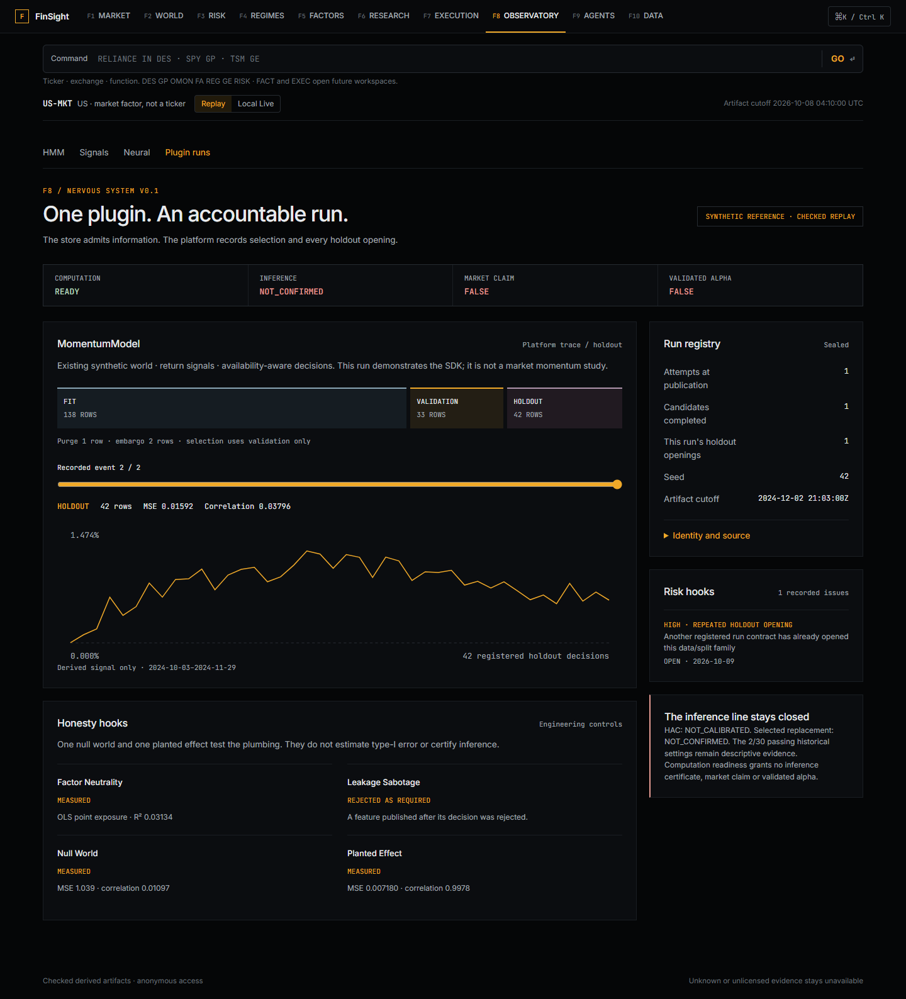
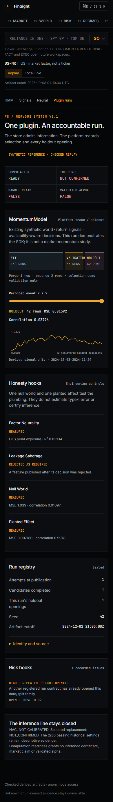

# Plugin SDK v0.1

`finsight.plugins` supplies a typed PIT store, nested chronological splits, validation-only selection, immutable run records, an attempt ledger, engineering controls and publication hooks. A computation can be ready while its inference, market and alpha flags remain false. The closed Research OS results remain `NOT_CALIBRATED` and `NOT_CONFIRMED`; the two passing v0.1.1 settings are descriptive evidence only.

## Run the checked example

From the repository root, install the project in your local Python environment and run:

```sh
python -m pip install -e .
python scripts/verify_plugin_replay.py
python scripts/export_plugin_replay.py --refresh
```

The public example already has a recorded execution. An unchanged refresh verifies the same checked inputs, source code, wrapped-engine dependencies and Python/runtime identity, makes no new attempt and opens no holdout. A changed computation creates a new run; the exporter restores the checked prior registry into an empty local registry, retaining earlier attempts and openings. Repeat execution of the same run contract reuses the sealed result. This is local trusted Python execution, not a sandbox for arbitrary third-party plugins.

The default local DuckDB/Parquet store and SQLite registry live in ignored `data/exports/replay-source/nervous-runtime/`. Public, derived run metadata and the complete attempt chain are under `data/exports/nervous_system_v0_1/`; no runtime database is committed. Receipts and snapshots also retain content-addressed historical copies. The nightly `organs.yml` job uses the same pipeline and commits only derived publication/history paths after verification. v0.1 refreshes the checked fixture; network adapters and broader Risk Manager sweeps belong to later phases.

## The 30-line model

This is the complete [example](../examples/momentum_plugin.py). The name illustrates the requested SDK interface. It is a small least-squares engineering reference, not a rerun of the market momentum study.

```python
"""A 30-line SDK example on a checked synthetic fixture, not a market study."""
import numpy as np
import pandas as pd
from finsight.plugins import Model, InferenceCapability


class MomentumModel(Model):
    inputs = ["market_return", "volatility"]
    outputs = ["momentum_signal"]
    capability = InferenceCapability(
        method="NULL_MBB_T", confirmation_status="NOT_CONFIRMED",
        descriptive_only_settings=("2/30 historical settings; no certification",),
    )

    def fit(self, train):
        x = train[self.inputs].to_numpy(dtype=float)
        y = train.target.to_numpy(dtype=float)
        self.center = x.mean(axis=0)
        design = np.column_stack([np.ones(len(x)), x - self.center])
        self.weights = np.linalg.lstsq(design, y, rcond=None)[0]

    def predict(self, rows):
        x = rows[self.inputs].to_numpy(dtype=float) - self.center
        design = np.column_stack([np.ones(len(x)), x])
        return pd.DataFrame({"momentum_signal": design @ self.weights}, index=rows.index)

    def trace(self):
        return {"weights": self.weights.tolist(), "inputs": self.inputs,
                "semantics": "Actual development-fit coefficients; synthetic plumbing evidence",
                "inference_certified": False}
```

Register a class with `PluginCatalog.register(name, model_type)`, then call `catalog.run(name, runner, **request)`. All registered models receive the same store, split, accounting, control, trace and issue hooks. A request explicitly names a tenant, asset, decision grid, cutoff, seed, candidate configurations, horizon and embargo. Supervised requests also provide target values and genuine realization clocks. Optional factor exposure inputs require matching row identities and their own information clocks.

`fit(train)` sees the admitted training portion and its labels. `predict(rows)` receives only declared features and clocks, with no target column. Return a DataFrame with exactly the declared output columns and unchanged index. The platform checks types and finite values before scoring. Candidate failure aborts the run and remains recorded; it never silently tries a fallback after opening holdout.

## Signal and clock contract

Each immutable signal contains `tenant_id`, `name`, `asset`, `value`, `observed_at`, `available_at`, `source`, `licence`, `version`, `kind` and `unit`. Clocks have explicit timezones and availability cannot precede observation. Supported scalar types are float, int, bool and category; structured local engine inputs use bounded, canonical JSON strings. Type/unit declarations are immutable within a tenant. Changes require a new signal name or a new correctly timed vintage, not replacement of an existing identity.

Use `SignalStore.append(tenant_id, signals)`, `read(tenant_id, name, asset, as_of=...)`, or `frame(tenant_id, asset, specs, decisions, as_of=...)`. The frame selects the last unambiguous observation/version actually available at each decision. A late revision does not backfill old decisions. Future observations, future publications, missing signals and ambiguous vintages fail closed. A declaration must match the stored kind and unit.

Parquet stores admitted payloads, while DuckDB indexes committed batches. Reads verify payload hashes, admission binding and the tenant's resolved directory; unindexed files are ignored. Local storage supports one writer process, with transaction boundaries and an in-process lock. These integrity checks detect substitution against retained seals; local files are not an external signature or an entitlement system. Python callers must receive their tenant identity from their own trusted local/authenticated context.

The existing AsOf and chronological splitter supply the boundaries. In the checked example, 219 decisions give 138 inner fit rows, 33 validation rows, 174 development rows and 42 holdout rows, with horizon purge 1 and embargo 2. Training label realization must strictly precede the next split's first decision. Selection is frozen before the ledger records holdout access, and access is recorded before prediction, including failed prediction. Another configuration/source contract using the same data/holdout family raises a linked repeated-opening issue; no failure or opening is erased.

## Preserved engines

| Catalog name | Preserved implementation | Adapter boundary |
| --- | --- | --- |
| `hmm` | `src.regime.hmm_regime` | Fit on platform training; decode each held-out prefix and take only its last state. No later row revises an earlier state. |
| `gbm-suite` | Existing estimator factories and training/prediction helpers | Declare each model family as a platform candidate. The adapter does not call the suite's hidden internal holdout. |
| `mlp` | `src.ml.neural` | Existing binary-label trainer, actual epoch/weight snapshots; no new neural architecture or search. |
| `hawkes` | D0.4.2 `_event_fit` / preserved exponential estimator | Published event windows with nested clock checks; expose the development-fit branching ratio, not a causal graph or forecast. |
| `volatility-clustering` | D0.4.2 `volatility_path` | Causal return prefixes; unsupported/warmup components remain null and `UNRESOLVED`. |
| `monte-carlo-var` | Existing GBM simulator and VaR/CVaR functions | Unit-notional one-session simulated return distribution; frozen development parameters and seed. |
| `d0.4.2` | Existing world validator and `compile_world` | Reject future data inside a declared world vintage; preserve incomplete vectors and partial fracture scores. |

Computation adapters use the same nested chronology and access ledger with one declared configuration. They have no supervised target, no invented validation score and no parameter tournament. Task-incompatible null/planted controls and missing factor exposure are explicitly unavailable, with linked issue records. Their optional full traces remain in the local registry; arbitrary plugin extensions are never copied wholesale to public Replay.

## Honesty, publication and evidence

Null/planted hooks run one fixed engineering control each with a namespaced seed. They test the plumbing; they do not estimate type-I error, power, calibrated uncertainty or financial alpha. The leakage hook sabotages the same boundary validator used for actual features. Factor exposure is an OLS point diagnostic, with no p-value, confidence interval or neutrality certificate.

The worked run uses 220 return-only rows extracted from the preserved D0.4.2 synthetic world, sealed in `eval/plugins/nervous-system-v0.1/pit-fixture.json`. Both return and factor availability clocks are explicit simulation clocks, not vendor release evidence. It is labelled `SYNTHETIC_REFERENCE` throughout. Current public French/IIMA captures remain research evidence and cannot establish historical PIT availability for this SDK example. No new market source is introduced here.

Two example run contracts are retained. The first was executed at `e133d5c`; a subsequent identity correction at `5444b37` bound all wrapped-engine dependencies and the Python/runtime identity. Each opened its holdout once. The same synthetic data family therefore has two recorded openings, and the current Replay visibly carries the resulting HIGH repeated-opening issue. This is an engineering identity repair, not model selection or a new inference tournament; the earlier result, receipt and publication are retained rather than replaced.

Public publication is an explicit hook on a sealed, committed computation. v0.1 permits only the approved checked fixture tenant/source/version and reviewed `momentum_signal` output; other sources require a real policy grant and are outside this public example. A vendor's self-declared `FIRST_PARTY` label grants no permission. Alpaca, yfinance and NSE India VIX stay unavailable publicly. The projector includes derived outputs, evaluation events, diagnostic hooks and linked issues, and excludes raw store values and arbitrary trace extensions. It preserves existing Replay entries and binds new artifact SHA/byte count to the immutable registry through a separate publication event.

Inspect `/observatory?scene=plugin` in F8. The shared Replay reader verifies licence, bytes and SHA; the plugin reader additionally verifies source/scope, run identity, chronology, types, selection, accounting and false claim flags. Any substituted bytes, tenant, scope, opening count or claim produces an unavailable screen, with no retained chart. Local Live directs plugin work to the local SDK instead of presenting Replay as a live run. F5 and F7 retain their browser behavior.





## Verification and Postable result

Focused Python checks cover future append/revision invariance, asset rename, return-price scaling, dual-clock cutoffs, tenant isolation, type enforcement, leakage sabotage, deterministic identity, failure accounting, holdout access, Parquet substitution, registry restoration and publication permissions. Real engine smoke tests cover every wrapper and prefix invariance. `verify_plugin_replay.py` audits the sealed actual run without computation, and `verify-plugins.mjs` checks its semantic contracts plus Chrome, Edge and Firefox desktop/mobile/failure views. The historical audit binds the original frozen guard to its recorded confirmation execution, without changing scientific source or numerical artifacts.

The shared archive boundary also retains every pre-Phase-2 public file and manifest entry. Only the checked synthetic plugin artifacts and `/plugins/momentum-fixture` route may be appended. Its sabotage tests reject old file substitution even after commit, changed routing/source/clock/claim metadata, unreviewed additions and forged plugin claims or tenants after rehashing. The original historical phase boundary remains checked at the closed main commit.

FinSight's 30-line plugin produced 42 held-out outputs on a checked synthetic PIT fixture, with selection and holdout access recorded in one registry. The same interface supplies engineering controls, exposure diagnostics, actual trace events and source-checked Replay publication. Computation is ready while inference remains NOT_CONFIRMED and market/alpha claims remain false.

Record F8 `/observatory?scene=plugin` at 1440px and 390px: the final holdout frame with capability strip, scrub to validation, then expand **Identity and source** to show the run, commit, source and licence. Include the honesty hooks and Risk hooks in the capture. These screens demonstrate platform accountability, not trading performance.

Storage references: [DuckDB Python client](https://duckdb.org/docs/stable/clients/python/overview) and [Arrow Parquet](https://arrow.apache.org/docs/python/parquet.html).
