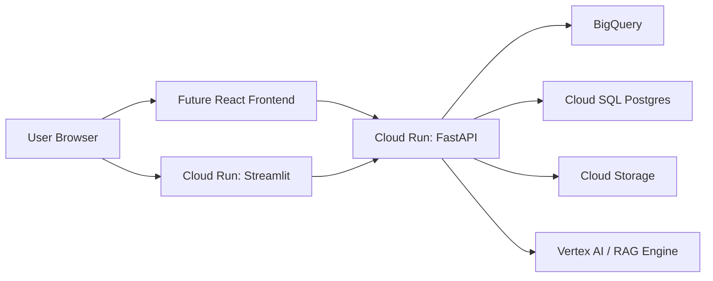

# Cloud Deployment Notes (Google Cloud)

This document explains how FinSight Alpha is designed to run on Google Cloud, and
how the placeholder integrations (BigQuery, Cloud Storage, Cloud SQL, Vertex AI)
will be activated in later phases. Nothing here is required to run the project
locally.

## Overview



## 1. Deploying the Streamlit dashboard to Cloud Run

Cloud Run runs stateless containers and injects a `$PORT` env var, which our
`Dockerfile.streamlit` already honours.

```bash
# Build and push with Cloud Build, then deploy.
gcloud builds submit --tag gcr.io/$GCP_PROJECT_ID/finsight-streamlit \
  --file infra/Dockerfile.streamlit .

gcloud run deploy finsight-streamlit \
  --image gcr.io/$GCP_PROJECT_ID/finsight-streamlit \
  --region asia-south1 \
  --allow-unauthenticated \
  --memory 1Gi
```

Notes:
- Streamlit binds to `0.0.0.0:$PORT` and runs `--server.headless=true`.
- Set secrets (API keys) via `--set-env-vars` or Secret Manager, not in the image.

## 2. Deploying the FastAPI backend to Cloud Run

`Dockerfile.api` runs `uvicorn backend.main:app` on `$PORT`.

```bash
gcloud builds submit --tag gcr.io/$GCP_PROJECT_ID/finsight-api \
  --file infra/Dockerfile.api .

gcloud run deploy finsight-api \
  --image gcr.io/$GCP_PROJECT_ID/finsight-api \
  --region asia-south1 \
  --allow-unauthenticated \
  --memory 512Mi
```

The Streamlit service (or a future React frontend) calls this API over HTTPS.

## 3. Future data integrations

### BigQuery (analytics warehouse)
- Activated in `src/data/storage.py::upload_to_bigquery`.
- Store processed daily bars + computed metrics in partitioned tables for fast
  historical queries and as the retrieval corpus backing analytics.
- Auth via `GOOGLE_APPLICATION_CREDENTIALS` (service account) and
  `GCP_PROJECT_ID` / `BIGQUERY_DATASET` from the environment.

### Cloud Storage (object store)
- Activated in `src/data/storage.py::upload_to_cloud_storage`.
- Store raw CSV/Parquet exports and generated artifacts (charts, reports) in
  `gs://$GCS_BUCKET_NAME/...`.

### Cloud SQL (Postgres)
- Use `DATABASE_URL` (SQLAlchemy) for transactional/app state: watchlists, user
  settings, cached summaries.
- `psycopg2-binary` + `sqlalchemy` are already in `requirements.txt`.

### Vertex AI + RAG Engine (Phase 1D+)
- Vertex AI for model training/serving (forecasting, volatility models).
- Vertex AI RAG Engine to answer natural-language questions over the stored
  datasets and generated reports: index BigQuery/GCS content, retrieve relevant
  context, and ground LLM answers in the project's own market data.

## 4. CI/CD (later)
- Cloud Build triggers on push to `main`: run `pytest`, build both images, deploy
  to Cloud Run. Promote via tags/revisions with traffic splitting.
