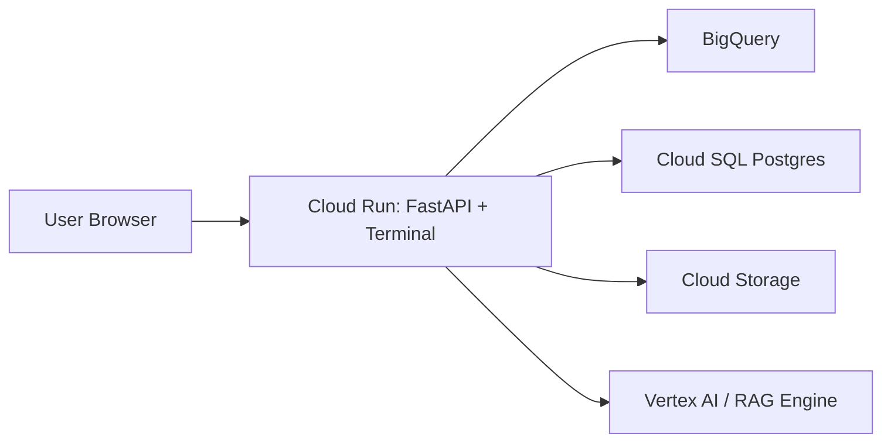

# Cloud Deployment Notes (Google Cloud)

FinSight Alpha currently deploys as one FastAPI Cloud Run service. That service
also serves the browser terminal, risk page, and login page, so no separate UI
container is required.

## Overview



## 1. Deploying The FastAPI App

`infra/Dockerfile.api` runs `uvicorn backend.main:app` on `$PORT`.

```bash
gcloud builds submit --tag gcr.io/$GCP_PROJECT_ID/finsight-api \
  --file infra/Dockerfile.api .

gcloud run deploy finsight-api \
  --image gcr.io/$GCP_PROJECT_ID/finsight-api \
  --region asia-south1 \
  --allow-unauthenticated \
  --memory 1Gi
```

Open the terminal at `/terminal` on the deployed service URL.

## 2. Future Data Integrations

### BigQuery

- Store processed daily bars and computed metrics in partitioned tables.
- Auth via `GOOGLE_APPLICATION_CREDENTIALS` locally or the Cloud Run service
  account in production.
- Configure `GCP_PROJECT_ID` and `BIGQUERY_DATASET`.

### Cloud Storage

- Store raw CSV/Parquet exports and generated artifacts in
  `gs://$GCS_BUCKET_NAME/...`.

### Cloud SQL

- Use `DATABASE_URL` for transactional app state: watchlists, user settings, and
  cached summaries.

### Vertex AI And RAG

- Vertex AI can be explored later for model serving.
- RAG can remain local with FAISS/Chroma until the document corpus needs managed
  infrastructure.

## 3. CI/CD Later

A future Cloud Build or GitHub Actions flow should run `pytest`, build the API
image, and deploy to Cloud Run with revision-based promotion.
