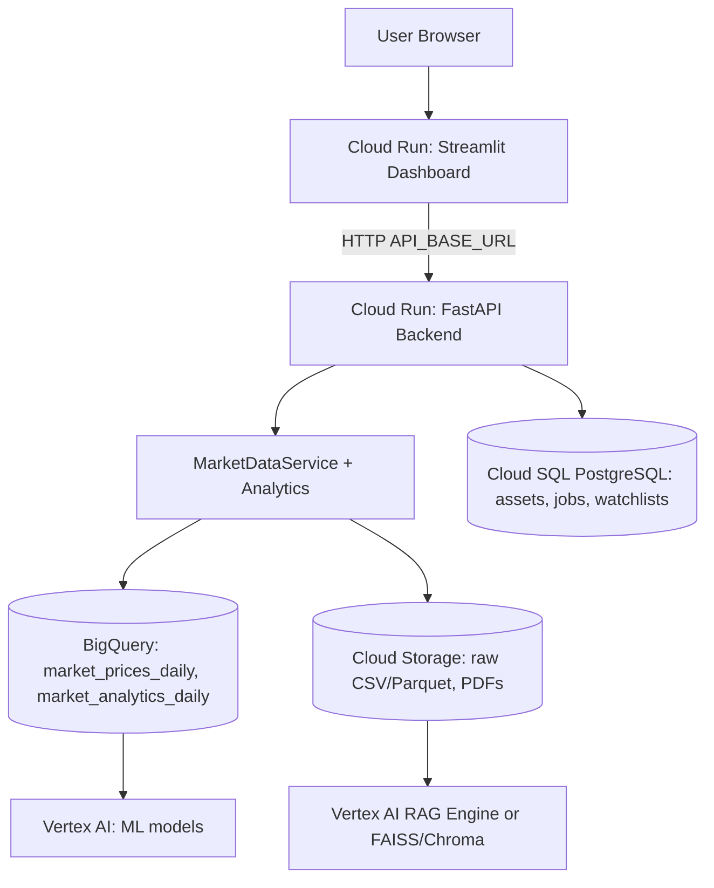

# FinSight Alpha - Future Google Cloud Architecture

This document describes the target cloud architecture. Nothing here is required
to run locally; the app degrades gracefully when GCP is not configured. Each
piece maps to code that already exists as a client/placeholder.

## High-level diagram

## Components

### 1. Streamlit Dashboard on Cloud Run
- Built from `infra/Dockerfile.streamlit`, binds to `$PORT`.
- Runs in API Mode in the cloud, calling the FastAPI service via `API_BASE_URL`.

### 2. FastAPI Backend on Cloud Run
- Built from `infra/Dockerfile.api`, serves `/health`, `/assets`,
  `/market-data/*`, `/analytics/*`.
- Stateless and horizontally scalable; the natural home for future auth,
  caching, and rate limiting.

### 3. Market data in BigQuery
- Tables `market_prices_daily` and `market_analytics_daily`
  (see `sql/bigquery_schema.md`).
- Columnar + partitioned/clustered for fast, cheap queries over years of data
  across many tickers. Loaded via `src/data/bigquery_client.py`.

### 4. App metadata in Cloud SQL (PostgreSQL)
- Tables `assets`, `data_ingestion_jobs`, `watchlists`, `watchlist_assets`
  (see `sql/001_create_tables.sql`).
- Relational, transactional store for small, frequently-updated records.
  Accessed via `src/data/database.py`.

### 5. Raw files and PDFs in Cloud Storage
- Raw CSV/Parquet exports and, later, financial PDFs/filings.
- Object storage is cheap and durable; it is also the staging area for RAG.
  Accessed via `src/data/cloud_storage_client.py`.

### 6. ML in Vertex AI (later)
- Train/serve forecasting and volatility models using features derived from the
  BigQuery analytics tables.

### 7. RAG in Vertex AI RAG Engine or FAISS/Chroma (later)
- Index documents in Cloud Storage + structured analytics in BigQuery, retrieve
  relevant context, and ground LLM answers in FinSight's own data.

## Why this split?
- **BigQuery** = analytical (OLAP) scale for time-series and aggregates.
- **Cloud SQL** = transactional (OLTP) integrity for app metadata.
- **Cloud Storage** = durable blobs (files/PDFs) and the RAG corpus.
- **Cloud Run** = stateless, autoscaling compute for both UI and API.
