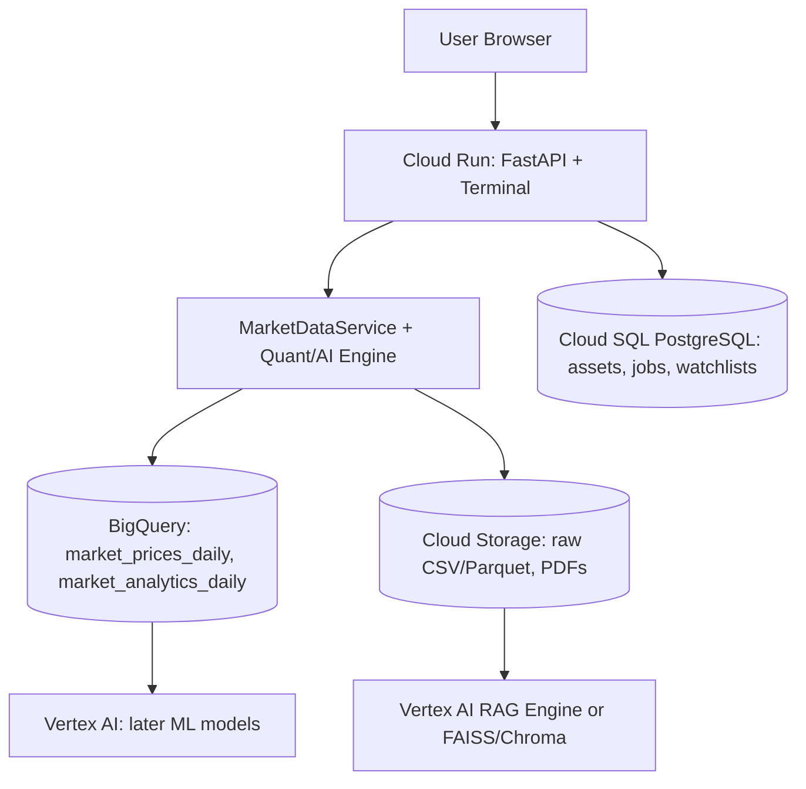

# FinSight Alpha - Future Google Cloud Architecture

This document describes the target cloud architecture. Nothing here is required
to run locally; the app degrades gracefully when GCP is not configured.

## High-level Diagram

## Components

### 1. FastAPI + Terminal On Cloud Run

- Built from `infra/Dockerfile.api`.
- Serves `/health`, `/docs`, feature APIs, and the browser terminal at
  `/terminal`.
- Stateless and horizontally scalable; the natural home for auth, caching, and
  rate limiting.

### 2. Market Data In BigQuery

- Tables `market_prices_daily` and `market_analytics_daily`.
- See `sql/bigquery_schema.md` for the intended schema.
- Loaded via `src/data/bigquery_client.py`.

### 3. App Metadata In Cloud SQL

- Tables `assets`, `data_ingestion_jobs`, `watchlists`, and `watchlist_assets`.
- See `sql/001_create_tables.sql`.
- Accessed via `src/data/database.py`.

### 4. Raw Files And Documents In Cloud Storage

- Raw CSV/Parquet exports and financial PDFs/filings.
- Staging area for RAG ingestion.
- Accessed via `src/data/cloud_storage_client.py`.

### 5. ML And RAG Expansion

- Vertex AI can train or serve forecasting and volatility models later.
- Vertex AI RAG Engine can be evaluated later, but local FAISS/Chroma remains the
  simple path for development.

## Why This Split?

- BigQuery: analytical time-series scale.
- Cloud SQL: transactional app metadata.
- Cloud Storage: durable files and document corpus.
- Cloud Run: stateless app and API compute.
